# ディープラーニングチューニングプレイブック日本語版

[Deep Learning Tuning Playbook](https://github.com/google-research/tuning_playbook)の日本語版です．

*本製品はGoogleの公式サポート製品ではありません*

**Varun Godbole<sup>&dagger;</sup>, George E. Dahl<sup>&dagger;</sup>, Justin Gilmer<sup>&dagger;</sup>, Christopher J. Shallue<sup>&Dagger;</sup>, Zachary Nado<sup>&dagger;</sup>**


&dagger; Google Research, Brain Team

&Dagger; Harvard University

## 目次

- [このドキュメントは誰のためにあるのか](#who-is-this-document-for)
- [なぜチューニングのプレイブックなのか](#why-a-tuning-playbook)
- [新しいプロジェクトを始めるためのガイド](#guide-for-starting-a-new-project)
    - [モデルアーキテクチャの選択](#choosing-a-model-architecture)
    - [オプティマイザの選択](#choosing-the-optimizer)
    - [バッチサイズの選択](#choosing-the-batch-size)
    - [初期設定の選択](#choosing-the-initial-configuration)
- [モデル性能を向上させる科学的アプローチ](#a-scientific-approach-to-improving-model-performance)
    - [インクリメンタルチューニング戦略](#the-incremental-tuning-strategy)
    - [探索と探索の比較](#exploration-vs-exploitation)
    - [次の実験の目標を決める](#choosing-the-goal-for-the-next-round-of-experiments)
    - [次のラウンドの実験の設計](#Designing-the-next-round-of-experiments)
    - [実験結果からの洞察の抽出](#Extracting-insight-from-experimental-results)
    - [学習パイプラインの変更やハイパーパラメータの設定を採用するかどうかの判断](#Determining-whether-to-adopt-a-training-pipeline-change-or-hyperparameter-configuration)
    - [探索終了後](#After-exploration-concludes)
- [各学習実行のステップ数の決定](#Determining-the-number-of-steps-for-each-training-run)
    - [訓練が計算機バウンドしない場合の訓練時間の決定](#Deciding-how-long-to-train-when-training-is-not-compute-bound)
    - [学習が計算機バウンドする場合の学習時間を決める](#Deciding-how-long-to-train-when-training-is-compute-bound)
- [学習パイプラインの追加ガイダンス](#Additional-guidance-for-the-training-pipeline)
    - [入力パイプラインの最適化](#Optimizing-the-input-pipeline)
    - [モデル性能の評価](#Evaluating-model-performance)
    - [チェックポイントの保存と最適なチェックポイントの遡及選択](#Saving-checkpoints-and-retrospectively-selecting-the-best-checkpoint)
    - [実験追跡の設定](#Setting-up-experiment-tracking)
    - [バッチノーマライズの実装詳細](#Batch-normalization-implementation-details)
    - [マルチホストパイプラインの注意点](#Considerations-for-multi-host-pipelines)
- [よくある質問](#faqs)
- [謝辞](#acknowledgments)
- [引用](#citing)
- [寄稿](#contributing)

<a id="who-is-this-document-for"></a>
## このドキュメントは誰のためにあるのか

このドキュメントは，**深層学習モデルの性能の最大化**に興味のあるエンジニアやスタディ者（個人とチームの両方）向けのものです．
機械学習と深層学習の概念に関する基本的な知識を前提としています．

我々は**ハイパーパラメータチューニングの過程**に重点を置いています．我々は，他の
パイプラインの実装や最適化など，深層学習学習の他の側面にも触れていますが，これらの取り扱いは完全なものではありません．

機械学習の問題は，教師あり学習，またはそれによく似たもの(例：自己教師あり学習)であると仮定します．とはいえ，この文書に書かれている手法は，他の種類の問題にも適用できるかもしれません．

<a id="why-a-tuning-playbook"></a>
## なぜチューニングのプレイブックなのか

現在，ディープニューラルネットワークを実際にうまく機能させるためには，驚くほど多くの労力と推測が必要です．さらに悪いことに，深層学習で良い結果を得るために実際に使われるレシピが文書化されることは稀です．論文では，よりきれいなストーリーを提示するために，最終的な結果に至ったプロセスは無視され，商業的な問題に取り組む機械学習エンジニアには，一歩下がってそのプロセスを一般化する時間はほとんどありません．教科書は，たとえ著者が有用な助言を提供するために必要な応用経験を有していたとしても，実用的な指針を避け，基本原理を優先する傾向がある．このドキュメントを作成する準備をしていたとき，私たちは，*深層学習で良い結果を得る方法*を実際に説明する包括的な試みを見つけることができませんでした．その代わりに，ブログ記事やソーシャルメディア上のアドバイスの断片，スタディ論文のappendixから覗くトリック，ある特定のプロジェクトやパイプラインに関する時折のケーススタディ，そして多くの混乱が見受けられました．深層学習の専門家が達成した結果と，表面的に類似した手法を使用するあまり熟練していない従事者の間には，大きな隔たりがある．同時に，これらの専門家は，彼らが行うことの一部が正当化されないかもしれないことを容易に認めています．深層学習が成熟し，世界に大きな影響を与えるようになると，コミュニティは，良い結果を得るために非常に重要であるすべての実用的な詳細を含む有用なレシピをカバーする，より多くのリソースを必要とします．

私たちは5人のスタディ者とエンジニアからなるチームで，長年にわたってディープラーニングに取り組んできました．我々は音声認識から天文学まであらゆる問題にディープラーニングを適用し，その過程で多くのことを学んできた．このドキュメントは，私たち自身がニューラルネットワークを使用し，新しい機械学習エンジニアを指導し，深層学習の実践について同僚に助言してきた経験から生まれたものです．深層学習が，一握りの学術スタディ所で行われていた機械学習の手法から，何十億人もの人々が使う製品に力を与える技術になったことは喜ばしいことだが，深層学習は工学分野としてはまだ初期段階にあり，この文書によって，この分野の実験プロトコルを体系化する手助けになればと願っています． 

この文書は，私たちが深層学習に対する独自のアプローチを具体化しようとしたときに生まれたものであり，したがって，執筆時の著者の意見を表したものであって，ある種の客観的な真実ではありません．私たちはハイパーパラメータのチューニングに苦労したため，特に重点を置いていますが，私たちが仕事で遭遇した（あるいはうまくいかないのを見た）他の重要な問題も取り上げています．私たちは，この著作を，私たちの信念の変化に応じて成長し，進化する生きた文書とすることを意図しています．例えば，学習の失敗のデバッグと軽減に関する資料は，最近の結果や進行中の調査に基づいているため，2年前に書くことは不可能だったでしょう．新しい結果やワークフローの改善を考慮し，私たちのアドバイスの一部を更新する必要があるのは必然です．私たちは，最適な深層学習のレシピを知りませんが，コミュニティが様々な手順を書き留め，議論し始めるまでは，それを見つけることは望めません．そのため，私たちのアドバイスに問題を見つけた読者は，説得力のある証拠とともに代替の推奨事項を提示し，私たちがプレイブックを更新できるようにすることをお勧めします．また，私たちは，コミュニティとしてベストプラクティスを追求するために，異なる推奨事項を持つ可能性のある代替ガイドやプレイブックをぜひ見てみたいと思っています．最後に，🤖の絵文字がついた箇所は，私たちがもっと調査をしたい場所です．このプレイブックを書いてみて初めて，深層学習の実践者のワークフローに，いかに多くの興味深い，そして無視されていたスタディ課題があるかが完全に明らかになりました．

<a id="guide-for-starting-a-new-project"></a>
## 新しいプロジェクトを始めるためのガイド

チューニングの過程で行う決定の多くは，プロジェクト開始時に一度だけ行い，状況が変化したときに時折見直す程度です．

以下のガイダンスでは，次のような前提を置いています．

-   問題設定やデータクリーニングなどの基本的な作業はすでに十分行われており，モデル・アーキテクチャや学習の設定に時間をかけることは理にかなっています．
-   学習と評価を行うパイプラインがすでに設定されており，興味のある様々なモデルの学習と予測のジョブを簡単に実行することができます． 
-   適切な評価指標が選択され，実装されている．これらは，導入された環境で測定されるものを可能な限り代表するものでなければなりません．

<a id="choosing-a-model-architecture"></a>
### モデルアーキテクチャの選択

***要約:*** *新しいプロジェクトを始めるときは，すでに動作しているモデルを再利用するようにしましょう．*
-   最初に動作させるために，よく確立された，一般的に使用されているモデルアーキテクチャを選択します．後でカスタムモデルを構築することはいつでも可能です．
-   モデル・アーキテクチャは通常，モデルのサイズやその他の詳細（層数，層幅，活性化関数の種類など）を決定するさまざまなハイパーパラメータを持っています．
    -   したがって，アーキテクチャを選択するということは，実際には系列の異なるモデルの（モデルのハイパーパラメータの各設定に対して1つ）を選択することを意味します．
    -   モデルのハイパーパラメータを選択する問題については，[初期設定の選択](#choosing-the-initial-configuration)と[モデル性能を向上させる科学的アプローチ](#a-scientific-approach-to-improving-model-performance).で検討することにしています．
-   可能であれば，できるだけ近い問題に取り組んでいる論文を探し，そのモデルを起点に再現するようにします．


<a id="choosing-the-optimizer"></a>
### オプティマイザの選択
***要約:*** *まず，問題の種類に応じた最も一般的なオプティマイザを使用します．*

-  機械学習の問題やモデル・アーキテクチャの種類を問わず，「ベスト」なオプティマイザは存在しない．[オプティマイザの性能を比較するだけでも難しい作業](https://arxiv.org/abs/1910.05446)である．🤖
-  特に新しいプロジェクトを始める際には，よく知られた一般的なオプティマイザを使用することをお勧めします．
   -  理想的には，同じ種類の問題に使用される最も一般的なオプティマイザを選択することです．
-  選択したオプティマイザの**\*****すべて****\***のハイパーパラメーターに注意を払う覚悟が必要です．
   -  より多くのハイパーパラメータを持つオプティマイザは，最適な構成を見つけるために，より多くのチューニングの労力を必要とする場合があります．
   -  このことは，プロジェクトの初期段階において，オプティマイザのハイパーパラメータを[迷惑パラメータ](#identifying-scientific-nuisance-and-fixed-hyperparameters)として扱いながら，他のさまざまなハイパーパラメータ（例えば，アーキテクチャーのハイパーパラメータ）の最適値を見つけようとする場合に特に関係します．
   -  プロジェクトの初期段階では，より単純なオプティマイザ（momentum(運動量)を固定したSGDや， $\epsilon$， $\beta_{1}$， $\beta_{2}$を固定したAdamなど）で開始し，後でより一般的なオプティマイザに切り替えることが望ましい場合があります．
-  私たちが気に入っている定評のあるオプティマイザは以下の通りです（ただし，これらに限定されるものではありません）:
   -  [SGD with momentum](#what-are-the-update-rules-for-all-the-popular-optimization-algorithms)
        (我々はNesterov variantを好んでいる)
    -   [Adamと，NAdam](#what-are-the-update-rules-for-all-the-popular-optimization-algorithms)は，SGD with momentum よりも一般的なものです．Adamは4つの調整可能なハイパーパラメータを持ち，[それらはすべて問題になり得る](https://arxiv.org/abs/1910.05446)ことに注意してください．
        -   [Adamのハイパーパラメータはどのように調整されるべきか？](#how-should-adams-hyperparameters-be-tuned)をご覧ください．

<a id="choosing-the-batch-size"></a>
### バッチサイズの選択
***要約:*** *バッチサイズは学習速度を制御するものであり，バリデーションセットの性能を直接調整するために使用するべきではありません．多くの場合，理想的なバッチサイズは，ハードウェアでサポート可能な最大のバッチサイズになります．*

-   バッチサイズは，学習時間と計算機資源の消費量を決定する重要な要素である．
-   バッチサイズを大きくすると，多くの場合，学習時間が短縮される．これは，以下のような理由で非常に有益である．
    -   一定時間内にハイパーパラメータをより徹底的に調整することができ，最終的なモデルがより良いものになる可能性があります．
    -   開発サイクルの待ち時間を短縮し，新しいアイデアをより頻繁にテストすることができます．
-   バッチサイズを大きくすると，リソース消費量が減少するか，増加するか，あるいは変化しないかのいずれかである．
-   バッチサイズは，バリデーションセットの性能のための調整可能なハイパーパラメータとして***扱われるべきではありません***．
    -   すべてのハイパーパラメータ（特に学習率と正則化のハイパーパラメータ）がうまく調整され，学習ステップ数が十分である限り，どのバッチサイズでも同じ最終性能を達成できるはずです（[Shallue et al.2018](https://arxiv.org/abs/1811.03600)参照）．
    -   [バリデーションセットの性能を直接向上させるためにバッチサイズをチューニングしてはいけない理由](#why-shouldnt-the-batch-size-be-tuned-to-directly-improve-validation-set-performance)をご覧ください．


<a id="determining-the-feasible-batch-sizes-and-estimating-training-throughput"></a>
#### 実現可能なバッチサイズの決定と学習スループットの見積もり
<details><summary><em>[Click to expand]</em></summary>

<br>

-   あるモデルとオプティマイザに対して，利用可能なハードウェアがサポートするバッチサイズの範囲が一般的に存在します．制限となるのは，通常，アクセラレータメモリです．
-   残念ながら，トレーニングプログラム全体を実行するか，少なくともコンパイルすることなく，どのバッチサイズがメモリに収まるかを計算するのは困難な場合があります．
-   最も簡単な解決策は，異なるバッチサイズ（例えば2の累乗）の学習ジョブを，利用可能なメモリを超えるまで，少ないステップ数で実行することです．
-   各バッチサイズにおいて，学習スループットの信頼できる推定値を得るのに十分な時間，学習を行う必要があります．

<p align="center">学習スループット = (処理件数/秒)</p>

<p align="center">もしくは， <em>ステップごとの時間</em>.</p>

<p align="center">ステップごとの時間 = (バッチサイズ) / (学習スループット)</p>

-   アクセラレータがまだ飽和していない場合，バッチサイズが2倍になると，学習スループットも2倍（または少なくともほぼ2倍）になるはずです．同様に，バッチサイズが大きくなっても，1ステップあたりの時間は一定でなければなりません（少なくともほぼ一定）．
-   もしそうでない場合は，計算ノード間のI/Oや同期など，学習パイプラインにボトルネックがあると考えられます．これは，先に進む前に診断し，修正する価値があるかもしれません．
-   もし，ある最大バッチサイズまでしか学習スループットが上がらないのであれば，より大きなバッチサイズがハードウェアによってサポートされていたとしても，その最大バッチサイズまでしか考慮しない方が良いでしょう．
    -   バッチサイズを大きくすることで得られるメリットは，すべて学習スループットが向上することを前提としています．そうでない場合は，ボトルネックを修正するか，より小さなバッチサイズを使用します．
    -   勾配累積は，ハードウェアがサポートできるよりも大きなバッチサイズをシミュレートするため，スループット上の利点はありません．一般に，応用的な作業では避けるべきです．
-   これらの手順は，モデルやオプティマイザが変更されるたびに繰り返す必要があるかもしれません（たとえば，モデルのアーキテクチャが変われば，メモリに収まるバッチサイズが大きくなる可能性があります）．

</details>


<a id="choosing-the-batch-size-to-minimize-training-time"></a>
#### 学習時間を最小にするためのバッチサイズの選択

<details><summary><em>[Click to expand]</em></summary>

<br>


<p align="center">学習時間 = (ステップごとの時間) x (総ステップ数)</p>

-   多くの場合，実行可能なすべてのバッチサイズにおいて，1ステップあたりの時間はほぼ一定であると考えることができます．これは，並列計算によるオーバーヘッドがなく，すべての学習ボトルネックが診断され修正されている場合に当てはまります（学習ボトルネックの特定方法については[前のセクション](#determining-the-feasible-batch-sizes-and-estimating-training-throughput)を参照してください）．しかし，実際には，バッチサイズを大きくすることにより，少なくともいくつかのオーバーヘッドが発生します．
-   バッチサイズが増加すると，一定の性能目標に到達するために必要なステップの総数は，通常減少します（バッチサイズが変更されたときに，すべての関連するハイパーパラメータが再チューニングされる場合；[Shallue et al.2018](https://arxiv.org/abs/1811.03600)）．
    -   例：バッチサイズを2倍にすると，必要な総ステップ数が半分になる場合がある．これを**パーフェクトスケーリング**と呼ぶ．
    -   完全スケーリングは，臨界バッチサイズまではすべてのバッチサイズで成立し，それを超えると収穫逓減(diminishing returns)となる．
    -   最終的には，バッチサイズを大きくしても学習ステップ数は減らない（増えることはない）．
-   したがって，学習時間を最小化するバッチサイズは，通常，必要な学習ステップ数の削減を実現する最大のバッチサイズとなる．
    -   このバッチサイズはデータセット，モデル，オプティマイザに依存し，新しい問題ごとに実験的に見つける以外に，どのように計算するかは未解決の問題である．🤖
    -   バッチサイズを比較する際には，example budget/[epoch](https://developers.google.com/machine-learning/glossary#epoch) budget（学習例の提示数を固定して全ての実験を行う）とstep budget（学習ステップ数を固定して全ての実験を行う）の違いに注意する必要があります．
        -   バッチサイズとエポックバジェットの比較は，バッチサイズを大きくしても，必要な学習ステップ数を減らすことで意味のある速度向上が得られる可能性があるにもかかわらず，完全なスケーリング領域を探るだけです．
    -   多くの場合，利用可能なハードウェアでサポートされる最大のバッチサイズは，クリティカルバッチサイズより小さくなる．したがって，経験則として（実験を行わずに），可能な限り大きなバッチサイズを使用するのがよい．
-   バッチサイズを大きくしても，学習時間が長くなっては意味がありません．

</details>

<a id="choosing-the-batch-size-to-minimize-resource-consumption"></a>
#### リソース消費を最小化するバッチサイズの選択

<details><summary><em>[Click to expand]</em></summary>

<br>

-   バッチサイズを大きくすることで発生するリソースコストは2種類あります:
    1. 初期費用：新しいハードウェアの購入や，マルチGPU/マルチTPUトレーニングを実装するためのトレーニングパイプラインの書き換えなど．
    2. 利用コスト：チームのリソース予算に対する課金，クラウドプロバイダーからの課金，電気代やメンテナンス費用など．
-   バッチサイズの増加に大きな初期費用がかかる場合は，プロジェクトが成熟し，費用対効果のトレードオフを評価しやすくなるまで，バッチサイズの増加を延期する方がよいでしょう．マルチホスト並列トレーニングプログラムの実装は，[バグ](#Considerations-for-multi-host-pipelines)や[微妙な問題](#Batch-normalization-implementation-details)を引き起こす可能性があるため，いずれにせよ，よりシンプルなパイプラインから始める方がよいでしょう．(一方，学習時間の大幅な高速化は，多くのチューニング実験が必要な初期段階において非常に有効です）．
-   ここでは，総使用コスト（複数の異なる種類のコストを含む）を「リソース消費量」と呼ぶことにします．資源消費は次のような要素に分解できる．

<p align="center">リソース消費量 = (ステップごとのリソース消費量) x (総ステップ数)</p>

-   通常，バッチサイズを大きくすることで，[ステップの総数を減らす](#choosing-the-batch-size-to-minimize-training-time)ことができる．リソースの消費量が増えるのか減るのかは，1ステップあたりの消費量がどう変化するかによる．
    -   バッチサイズを大きくすると，資源消費量が減少する場合がある．例えば，バッチサイズが大きい方が小さい方と同じハードウェアで各ステップを実行できる場合（1ステップあたりの時間が少し増えるだけ），ステップあたりのリソース消費量の増加は，ステップ数の減少に勝るかもしれない．
    -   バッチサイズを大きくしても，資源消費量が変わらない場合がある．例えば，バッチサイズを 2 倍にすることで，必要なステップ数が半分になり，使用する GPU の数が 2 倍になる場合，GPU 時間で見た総消費量は変わりません．
    -   バッチサイズを大きくすると，資源消費量が増加する場合があります．例えば，バッチサイズを大きくしてハードウェアのアップグレードが必要になった場合，1ステップあたりの消費量の増加がステップ数の減少を上回る可能性があります．

</details>

<a id="changing-the-batch-size-requires-re-tuning-most-hyperparameters"></a>
#### バッチサイズを変更すると，ほとんどのハイパーパラメータを再チューニングする必要がある

<details><summary><em>[Click to expand]</em></summary>

<br>

-   ほとんどのハイパーパラメータの最適値は，バッチサイズに敏感である．したがって，バッチサイズを変更すると，通常，チューニング・プロセスをすべてやり直す必要があります．
-   バッチサイズと最も強く相互作用するハイパーパラメータは，オプティマイザのハイパーパラメータ（学習率，運動量など）と正則化のハイパーパラメータで，各バッチサイズに対して個別に調整することが最も重要です．
-   プロジェクトの開始時にバッチサイズを選択する際には，この点に留意してください．後で別のバッチサイズに変更する必要がある場合，新しいバッチサイズ用にすべてを再チューニングするのは難しく，時間とコストがかかる可能性があります．

</details>

How batch norm interacts with the batch size
<a id="how-batch-norm-interacts-with-the-batch-size"></a>
#### バッチノルムとバッチサイズとの相互作用について

<details><summary><em>[Click to expand]</em></summary>

<br>

-   バッチノルムは複雑で，一般的には勾配計算とは異なるバッチサイズを使用して統計量を計算する必要があります．詳細な議論は[バッチノルムのセクション](#Batch-normalization-implementation-details)を参照してください．

</details>


<a id="choosing-the-initial-configuration"></a>
### 初期設定の選択

-   ハイパーパラメータのチューニングを開始する前に，開始点を決定する必要があります．これには，（1）モデル構成（例：層数），（2）オプティマイザのハイパーパラメータ（例：学習率），（3）学習ステップ数の指定が含まれる．
-   この初期設定の決定には，手動で設定したトレーニングの実行と試行錯誤が必要である．
-   我々の指針は，「妥当な」結果を得られる，シンプルで比較的高速，かつ資源消費の少ない設定を見つけることである．
    -   「シンプル」とは，可能な限り装飾を排し，後から追加できるようにすることです．たとえ，将来的に便利な機能であることがわかったとしても，初期設定にそれらを追加することは，役に立たない機能の調整や不必要な複雑化で時間を浪費する危険性があります．
        -   たとえば，派手な減衰スケジュールを追加する前に，一定の学習率で始める．
    -   高速で最小限のリソースを消費する初期設定を選択することで，ハイパーパラメータのチューニングをより効率的に行うことができます．
        -   例えば，より小さなモデルから始める．
    -   「妥当な」性能とは，問題によって異なりますが，最低限，学習したモデルがバリデーションセットにおいてランダムな偶然よりもはるかに良い性能を示すことを意味します（ただし，配備する価値がないほど悪い場合もあります）．
-   トレーニングステップ数の選択には，以下のような緊張感のバランスが必要です．
    -   一方，より多くのステップのトレーニングはパフォーマンスを向上させ，ハイパーパラメータのチューニングを容易にします（[Shallue et al.2018](https://arxiv.org/abs/1811.03600)参照）．
    -   一方，より少ないステップのためのトレーニングは，各トレーニングの実行がより速く，より少ないリソースを使用し，サイクル間の時間を短縮することによってチューニング効率を高め，より多くの実験を並行して実行することができることを意味します．さらに，不必要に大きなステップバジェットが最初に選択された場合，そのステップ数に対して学習率スケジュールがチューニングされた後など，この先変更することが困難な場合があります．


<a id="a-scientific-approach-to-improving-model-performance"></a>
## モデル性能を向上させる科学的アプローチ

この文書では，機械学習開発の究極の目標は，導入されたモデルの実用性を最大化することであるとする．開発プロセスの多くの側面はアプリケーションによって異なるが（例えば，時間の長さ，利用可能なコンピューティングリソース，モデルの種類），我々は通常，どの問題に対しても同じ基本ステップと原則を使用することができます．

以下のガイダンスでは，以下の前提を置いています．

-   妥当な結果を得るための設定と，完全に動作する学習パイプラインが既にある．
-   有意義なチューニング実験を行い，少なくともいくつかのトレーニングジョブを並行して実行するために十分な計算機資源がある．

<a id="the-incremental-tuning-strategy"></a>
### インクリメンタルチューニング戦略

***要約:*** *シンプルな構成から始め，問題に対する洞察を深めながら，徐々に改善していく．不必要に複雑化させないために，どのような改善も強力な証拠に基づいていることを確認してください．*

-   最終的な目標は，モデルの性能を最大化するような構成を見つけることです．
    -   場合によっては，決まった期限までにどれだけモデルを改善できるかを最大化することが目標になります（例：コンペティションに応募する）．
    -   また，モデルを無期限に改良し続けたい場合もあります（例：生産で使用するモデルを継続的に改良する）．
-   原理的には，アルゴリズムを使って可能な構成の空間全体を自動的に探索することで性能を最大化することができますが，これは現実的な選択肢ではありません．
    -   可能な構成の空間は非常に大きく，人の手を借りずにこの空間を効率的に探索するような高度なアルゴリズムはまだ存在しない．
-   ほとんどの自動探索アルゴリズムは，探索する構成のセットを定義する，手作業で設計された探索空間に依存しており，これらの探索空間はかなり重要になることがあります．
-   性能を最大化する最も効果的な方法は，単純な構成から始めて，問題に対する洞察を深めながら，段階的に機能を追加し，改良を加えていくことです．
    -   チューニングのたびに自動化された検索アルゴリズムを使用し，我々の理解が深まるにつれて検索空間を継続的に更新しています．
-   探せば探すほど，より良い構成が自然に見つかるので，「ベスト」なモデルは常に改善されていきます．
    -   私たちは，最適な設定を更新したとき，それをローンチと呼んでいます（実際の製品モデルのローンチに対応する場合もあれば，対応しない場合もあります）．
    -   各ローンチにおいて，学習パイプラインに不必要な複雑さを加えないように，その変更が幸運な構成に基づくランダムな偶然ではなく，強力な証拠に基づいていることを確認する必要があります．

私たちのインクリメンタルチューニングは，次の4つのステップを繰り返すというものである．

1.  次の実験のための適切なスコープを持ったゴールを特定する．
2.  この目標に向かって前進する一連の実験を設計し，実行する．
3.  その結果から，できることを学ぶ．
4.  新しい最適な構成を立ち上げるかどうかを検討する．

このセクションの残りの部分では，この戦略についてより詳細に検討する．


<a id="exploration-vs-exploitation"></a>
### 探索と探索の比較

***要約:*** *ほとんどの場合，私たちの第一の目標は，問題を洞察することです．*

-   バリデーションセットでの性能を最大化するためにほとんどの時間を費やすと思われるかもしれませんが，実際には問題に対する洞察を得るために大半の時間を費やし，バリデーション誤差に貪欲に集中する時間は比較的少ないのです．
    -   つまり，「探索」にほとんどの時間を費やし，「開拓」にはわずかしか時間を割かないのです．
-   長期的に見れば，最終的な性能を最大化したいのであれば，問題を理解することが重要である．短期的な利益よりも洞察力を優先させることが，私たちの助けになるのです．
    -   歴史的な偶然によって，よく機能する実行にたまたま存在した不要な変更を起動しないようにする．
    -   バリデーション誤差がどのハイパーパラメータに最も敏感か，どのハイパーパラメータが最も相互作用が強く，したがって一緒に再チューニングする必要があるか，どのハイパーパラメータが他の変更に比較的敏感で，したがって将来の実験で修正することができるかを特定する．
    -   過学習が問題になっている場合，新しい正則化因子など，試すべき新しい特徴の候補を提案する．
    -   役に立たない機能を特定し，その機能を削除することで，今後の実験の複雑さを軽減することができる．
    -   ハイパーパラメータのチューニングによる向上が飽和状態になったことを認識する．
    -   最適値付近の探索空間を狭め，チューニングの効率を向上させる．
-   最終的に貪欲になる準備が整えば，実験が調整問題の構造について最大限の情報を提供しなくても，純粋にバリデーション誤差に集中することができます．


<a id="choosing-the-goal-for-the-next-round-of-experiments"></a>
### 次の実験の目標を決める

***要約:*** *各ラウンドの実験には明確な目標があり，実験が実際に目標に向かって進展できるような十分狭い範囲でなければなりません．*

-  一度に複数の機能を追加したり，複数の質問に回答しようとすると，結果に対する個別の影響を切り分けることができなくなる可能性があります．
-  目標の例としては，以下のようなものがあります．
   -  パイプラインの改善の可能性を試す（新しい正則化因子，前処理の選択など）．
   -  特定のモデルのハイパーパラメータ（活性化関数など）の影響を理解する．
   -  バリデーション誤差を貪欲に最大化する


<a id="Designing-the-next-round-of-experiments"></a>
### 次のラウンドの実験の設計

***要約:*** *どのハイパーパラメータが実験目標に対する科学的ハイパーパラメータ，迷惑ハイパーパラメータ，固定ハイパーパラメータであるかを特定する．一連のスタディを作成し，科学的ハイパーパラメータの異なる値を比較しながら，迷惑ハイパーパラメータを最適化する．資源コストと科学的価値のバランスをとるために，迷惑ハイパーパラメータの探索空間を選択する．*


<a id="identifying-scientific-nuisance-and-fixed-hyperparameters"></a>
#### 科学的ハイパーパラメータ，迷惑ハイパーパラメータ，固定ハイパーパラメータの識別

<details><summary><em>[Click to expand]</em></summary>

<br>

-  与えられたゴールに対して，すべてのハイパーパラメータは，**科学的ハイパーパラメータ**，**迷惑ハイパーパラメータ**，または**固定ハイパーパラメータ**のいずれかになります．
   -  科学的ハイパーパラメータとは，モデルの性能に与える影響を測定するためのパラメータです．
   -  迷惑ハイパーパラメータは，科学的ハイパーパラメータの異なる値を公平に比較するために最適化する必要があるパラメータです．これは，統計学でいうところの[nuisance parameters](https://en.wikipedia.org/wiki/Nuisance_parameter)と同じようなものです．
   -  固定ハイパーパラメータは，現在の実験ラウンドでその値が固定されます．科学的ハイパーパラメータの異なる値を比較する際に，値を変更する必要がない（あるいは変更させたくない）ハイパーパラメータです．
      -  一組の実験に対して特定のハイパーパラメータを固定することによって，実験から得られた結論は，固定されたハイパーパラメータの他の設定に対しては有効でないかもしれないことを受け入れなければならない．言い換えれば，固定されたハイパーパラメータは，我々が実験から導き出した結論に警告を与えるものである．
-  例えば，「隠れ層の多いモデルがバリデーション誤差を減らすかどうかを判断する」ことが目的であれば，隠れ層の数は科学的ハイパーパラメータとなる．
   -  学習率は，各層数に対して個別に調整された場合にのみ，異なる数の隠れ層を持つモデルを公平に比較することができるので，迷惑ハイパーパラメータです（最適な学習率は，一般的にモデル・アーキテクチャに依存します）．
   -  活性化関数は，最適な活性化関数の選択がモデルの深さに依存しないことを事前の実験で決定している場合，または隠れ層の数についての結論を，活性化関数のこの特定の選択のみに制限することを望んでいる場合，固定ハイパーパラメータとすることができる．あるいは，各隠れ層の数に対して個別に調整する用意があれば，迷惑パラメータになる可能性もあります．
-  特定のハイパーパラメータが科学的ハイパーパラメータ，迷惑ハイパーパラメータ，または固定ハイパーパラメータであるかどうかは，そのハイパーパラメータに固有のものではなく，実験目標によって変化する．
   -  例えば，活性化関数の選択は，科学的ハイパーパラメータ（我々の問題にはReLUとtanhのどちらが良い選択か），迷惑ハイパーパラメータ（いくつかの異なる活性化関数の可能性を許容するとき，最良の5層モデルは最良の6層モデルより良いか），または固定ハイパーパラメータ（ReLUネットについて，特定の位置にバッチ正規化を追加すると良いか）などが考えられる．
-  新しい実験計画を立てる際には，まず，実験目的に応じた科学的なハイパーパラメータを特定する．
   -  この段階では，他のすべてのハイパーパラメータは迷惑ハイパーパラメータであると考える．
-  次に，いくつかの迷惑ハイパーパラメータを固定ハイパーパラメータに変換する．
   -  無限のリソースがあれば，科学的でないハイパーパラメータはすべて迷惑ハイパーパラメータとして残し，実験から得られる結論が固定されたハイパーパラメータ値に関する注意事項から解放されるようにすることができます．
   -  しかし，迷惑ハイパーパラメータを調整しようとすればするほど，科学的ハイパーパラメータの各設定に対して十分に調整することができず，実験から誤った結論に達してしまう危険性が高くなる．
   -  後述するように，このリスクには計算機予算を増やすことで対処できますが，多くの場合，最大リソース予算はすべての非科学的ハイパーパラメータを調整するのに必要な予算よりも少なくなってしまいます．
   -  我々は，迷惑ハイパーパラメータを固定ハイパーパラメータに変換するのは，固定ハイパーパラメータにすることによって生じる注意点が，迷惑ハイパーパラメータとして含むことのコストよりも小さいと判断したときである．
      -  ある迷惑ハイパーパラメータが科学的ハイパーパラメータと相互作用すればするほど，その値を固定化することのダメージは大きくなります．例えば，重み減衰の強さの最適値は，一般的にモデルサイズに依存するので，重み減衰の単一の特定の値を仮定して異なるモデルサイズを比較することは，あまり洞察的ではありません．
-  各ハイパーパラメータに割り当てるタイプは実験目標によって異なりますが，ハイパーパラメータの特定のカテゴリについては，以下のような経験則があります．
   -  様々なオプティマイザのハイパーパラメータ（学習率，運動量，学習率スケジュールパラメータ，アダ ムベータなど）のうち，少なくともいくつかは，他の変化と最も相互作用する傾向があるため，迷惑ハイパーパラメータになるでしょう．
      -  なぜなら，「現在のパイプラインに最適な学習レートは何か」というような目標では，あまり洞察が得られないからです - とにかく最適な設定は，次のパイプラインの変更で簡単に変わってしまうのです．
      -  リソースの制約や，科学的パラメータと相互作用しないという特に強い証拠がある場合，それらの一部を修正することがありますが，一般的には，科学的ハイパーパラメータの異なる設定間の公正な比較を行うために，オプティマイザのハイパーパラメータを個別に調整する必要があり，したがって固定化すべきではないと仮定すべきです．
         -  さらに，あるオプティマイザのハイパーパラメーター値を他の値より優先する先験的な理由もありません（例えば，通常，フォワードパスやグラジエントの計算コストに影響を与えることはありません）．
   -  これに対して，オプティマイザの選択は，通常，科学的ハイパーパラメータまたは固定ハイパーパラメータとなります．
      -  実験目標が2つ以上の異なるオプティマイザを公正に比較することである場合，科学的ハイパーパラメータとなります （例えば，「与えられたステップ数で最も低いバリデーション誤差を生成するオプティマイザを決定する」）．
      -  また，（1）過去の実験から，この問題に最適なオプティマイザは現在の科学的ハイパーパラメータに影響されないと考えられる，（2）学習曲線の推論が容易であるため，このオプティマイザを用いて科学的ハイパーパラメータの値を比較したい，（3）代替案よりもメモリ使用量が少ないため，このオプティマイザを使用したいなど，さまざまな理由から固定ハイパーパラメータにすることができます．
   -  正則化手法によって導入されるハイパーパラメータは，通常，迷惑ハイパーパラメータですが，正則化手法を全く含まないかどうかは，科学的ハイパーパラメータまたは固定ハイパーパラメータになります．
      -  例えば，ドロップアウトはコードの複雑さを増すので，それを含めるかどうかを決めるとき，「ドロップアウトなし」対「ドロップアウト」を科学的ハイパーパラメータとし，ドロップアウト率を迷惑ハイパーパラメータとする．
         -  この実験に基づいてパイプラインにドロップアウトを追加することを決定した場合，ドロップアウト率は将来の実験では迷惑ハイパーパラメータになります．
   -  アーキテクチャのハイパーパラメータは，しばしば科学的ハイパーパラメータまたは固定ハイパーパラメータとなる．なぜなら，アーキテクチャの変更は，サービスおよびトレーニングのコスト，レイテンシ，およびメモリ要件に影響を与える可能性があるからである．
      -  例えば，層数は学習速度とメモリ使用量に劇的な影響を与える傾向があるため，一般的に科学的または固定的なハイパーパラメータとなります．
-  場合によっては，迷惑ハイパーパラメータと固定ハイパーパラメータのセットは，科学的ハイパーパラメータの値に依存することになる．
   -  例えば，Nesterov momentumとAdamのうち，どのオプティマイザがバリデーション誤差を最小にするかを決定しようとします．科学的ハイパーパラメータはオプティマイザで， `{"Nesterov_momentum", "Adam"}`という値をとります．`optimizer="Nesterov_momentum"`という値は，迷惑な/固定ハイパーパラメータ`{learning_rate, momentum}`を導入しますが，`optimizer="Adam"`という値は，迷惑な/固定ハイパーパラメータ`{learning_rate, beta1, beta2, epsilon}`を導入します．
   -  科学的ハイパーパラメータの特定の値に対してのみ存在するハイパーパラメータは，**条件付きハイパーパラメータ**と呼ばれます．
   -  同じ名前だからといって，2 つの条件付きハイパーパラメータが同じだと仮定してはいけません! 上の例では，`learning_rate`という条件付きハイパーパラメータは，`optimizer="Nesterov_momentum"`と`optimizer="Adam"`では異なるハイパーパラメータになります．この2つのアルゴリズムでは，その役割は（同一ではないものの）似ていますが，それぞれのオプティマイザでうまく機能する値の範囲は，通常，数桁の違いがあります．

</details>


<a id="Creating-a-set-of-studies"></a>
#### スタディセットの作成

<details><summary><em>[Click to expand]</em></summary>

<br>

-   科学的ハイパーパラメータと迷惑ハイパーパラメータを特定したら，実験目標に向かって前進するための「スタディ」または一連のスタディを設計します．
    -   スタディは，その後の解析のために実行されるハイパーパラメータ設定のセットを指定する．各設定は"trial"と呼ばれます．
    -   スタディの作成には，通常，スタディ間で変化するハイパーパラメータの選択，それらのハイパーパラメータが取り得る値（「探索空間」）の選択，試験回数の選択，探索空間から多くの試験をサンプリングする自動探索アルゴリズムの選択が含まれます．あるいは，ハイパーパラメータ設定のセットを手動で指定して，スタディを作成することもできます．
-   スタディの目的は，科学的ハイパーパラメータの異なる値間の比較ができるだけ公平になるように，迷惑ハイパーパラメータを **「排除」**（または「最適化」）すると同時に，科学的ハイパーパラメータの異なる値でパイプラインを実行することにあります．
-   最も単純なケースでは，科学的パラメータの各構成に対して別々のスタディを行い，それぞれのスタディが迷惑ハイパーパラメータを調整することになります．
    -   例えば，Nesterov momentumとAdamの中から最適なオプティマイザを選択することが目的である場合，`optimizer="Nesterov_momentum"`，迷惑ハイパーパラメータは`{learning_rate, momentum}`とするスタディを作成し，もう一つのスタディは，`optimizer="Adam"`，迷惑ハイパーパラメータは`{learning_rate, beta1, beta2, epsilon}`とするスタディです．それぞれのスタディから最もパフォーマンスの良いトライアルを選択することで，2つのオプティマイザを比較することになります．
    -   ベイズ最適化や進化的アルゴリズムなどの勾配なし最適化アルゴリズムを使用して，迷惑ハイパーパラメータを最適化することができます．ただし，チューニングの[探索段階](#exploration-vs-exploitation)では，この設定におけるさまざまな利点から，準ランダム探索の使用を[推奨](#why-use-quasi-random-search-instead-of-more-sophisticated-black-box-optimization-algorithms-during-the-exploration-phase-of-tuning)しています．[探索が終わった後](#After-exploration-concludes)，もし最新のベイズ最適化ソフトウェアが利用できるのであれば，そちらを使用することをお勧めします．
-   科学的ハイパーパラメータの多数の値を比較したいが，それほど多くの独立したスタディを行うのは現実的でない，より複雑なケースでは，科学的パラメータを迷惑ハイパーパラメータと同じ探索空間に含め，探索アルゴリズムを使って一回のスタディで科学的ハイパーパラメータと迷惑ハイパーパラメータの両方の値をサンプルすることができます．
    -   このアプローチをとる場合，条件付きハイパーパラメータは，迷惑ハイパーパラメータのセットが科学的ハイパーパラメータのすべての値に対して同じでない限り，探索空間を指定することが困難であるため，問題が発生する可能性があります．
    -   この場合，ブラックボックス最適化ツールよりも準ランダム探索の方が，科学的ハイパーパラメータの値のサンプリングが比較的均一であるため，より[好ましい](#why-use-quasi-random-search-instead-of-more-sophisticated-black-box-optimization-algorithms-during-the-exploration-phase-of-tuning)と言えます．どのような探索アルゴリズムであっても，科学的パラメータを一様に探索することを何とか確認する必要があります．

</details>

<a id="Striking-a-balance-between-informative-and-affordable-experiments"></a>

#### 情報量の多い実験と手頃な実験のバランスをとること

<details><summary><em>[Click to expand]</em></summary>

<br>

-   試験や一連のスタディをデザインする際，以下の3つの望みを十分に達成するために，限られた予算を割り当てる必要があります．
    1.  科学的ハイパーパラメータの十分な異なる値を比較する．
    2.  十分な広さの探索空間で迷惑ハイパーパラメータを調整する．
    3.  迷惑ハイパーパラメータの探索空間を十分に密にサンプリングする．
-   この3つの条件を満たせば満たすほど，実験からより多くの知見を得ることができる．
    -   科学的ハイパーパラメータをできるだけ多くの値で比較することで，実験から得られる洞察の幅が広がる．
    -   できるだけ多くの迷惑ハイパーパラメータを含み，各迷惑ハイパーパラメータができるだけ広い範囲で変化するようにすると，科学的ハイパーパラメータの各構成の探索空間に「良い」値が**存在する**という確信が得られます．
        -   そうでなければ，科学的ハイパーパラメータの値によっては，より良い値が存在する可能性のある迷惑なパラメータ空間の領域を探索しないため，科学的ハイパーパラメータの値の間で不公平な比較をする可能性がある．
    -   迷惑ハイパーパラメータの探索空間をできるだけ密にサンプリングすることで，探索空間に存在する迷惑ハイパーパラメータの良い設定が探索手順によって発見されるという確信が得られます．
        -   そうでなければ，迷惑ハイパーパラメータのサンプリングで幸運になった値があるため，科学的パラメータの値の間で不公平な比較をすることになるかもしれません．
-   残念ながら，これら3つの次元のいずれかを改善するには，試行回数を増やしてリソースコストを上げるか，他の次元でリソースを節約する方法を見つける必要があります．
    -   どの問題にも特有の性質や計算上の制約があるため，これら3つの要望に対してどのようにリソースを配分するかは，ある程度専門的な知識が必要です．
    -   スタディを実行した後，我々は常にそのスタディが迷惑ハイパーパラメータを十分に調整したかどうか（すなわち，十分に広い空間を十分に広範に探索したかどうか）を把握し，科学的ハイパーパラメータ（[以下](#Extracting-insight-from-experimental-results)でさらに詳細に説明する）を公正に比較しようと努めています．

</details>

<a id="Extracting-insight-from-experimental-results"></a>
### 実験結果からの洞察の抽出

***要約:*** *各実験グループの本来の科学的目標を達成しようとするだけでなく，追加の質問事項をチェックリストで確認し，問題が発見された場合は，実験を修正して再実行します．*

-   最終的には，それぞれの実験グループには特定の目標があり，その目標に向かって実験が提供する証拠を評価したいのです．
    -   しかし，適切な質問をすれば，ある実験群が本来の目的に向かって大きく前進する前に，修正すべき問題が見つかることがよくあります．
        -   もし，このような質問をしなければ，間違った結論を導き出すことになるかもしれません．
    -   実験の実行にはコストがかかるため，たとえ現在の目標にすぐに関係しない場合でも，各実験グループから他の有用な洞察を引き出す機会を設けたいと考えている．
-   与えられた実験群を分析して本来の目的に向かって前進する前に，以下のような追加的な質問を自問する必要がある．
    -   [探索空間は十分に大きいか？](#identifying-bad-search-space-boundaries)
        -   あるスタディから得られた最適点が，1つまたは複数の次元の探索空間の境界付近にある場合，探索の幅が十分でない可能性がある．この場合，探索空間を拡張した別のスタディを行う必要があります．
    -   [探索空間から十分な点をサンプリングできたか？](#not-sampling-enough-points-in-the-search-space)
        -   もしそうでなければ，さらに多くのポイントを実行するか，チューニングの目標をより低く設定する．
    -   各スタディの試行の何パーセントが**実行不可能**か（すなわち，発散する試行，本当に悪い損失値を得る試行，あるいは何らかの暗黙の制約に違反するため全く実行できない試行）？
        -   試験で非常に大きな割合の点が**実行不可能**な場合，そのような点のサンプリングを避けるために探索空間を調整する必要がありますが，これには探索空間の再パラメータ化が必要な場合があります．
        -   場合によっては，多数の実行不可能なポイントが，学習コードのバグを示すことがあります．
    -   [モデルに最適化の問題はないのか？](#how-can-optimization-failures-be-debugged-and-mitigated)
    -   [最良の試行のトレーニングカーブから何がわかるか？](#examining-the-training-curves)
        -   例えば，最適な試行の学習曲線は過学習の問題と一致するか？
-   必要であれば，上記の質問に対する答えに基づいて，最新のスタディ（またはスタディグループ）を改良し，探索空間を改善するか，より多くの試行をサンプリングするか，または他の是正措置を取る．
-   上記の質問に答えることができたら，本来の目的に向かって実験が提供する証拠の評価（例えば，[変更が有用かどうかの評価](#detecting-whether-a-change-is-useful-with-isolation-plots)）に移ることができる．


<a id="identifying-bad-search-space-boundaries"></a>
#### 悪い探索空間の境界を特定する

<details><summary><em>[Click to expand]</em></summary>

<br>

-   探索空間からサンプリングされた最良の点がその境界の近くにある場合，その探索空間は疑わしい．もしその方向に探索範囲を広げれば，さらに良い点が見つかるかもしれません．
-   探索空間の境界を確認するために，我々は完了した試行を基本的なハイパーパラメータ軸プロットと呼ぶものにプロットするのが好きだ．プロット上の各ポイントは1つのトライアルに対応する．
    -   各試行のバリデーション目的値は，通常，訓練期間中に達成された最良の値であるべきである．

<p align="center" id="figure-1">
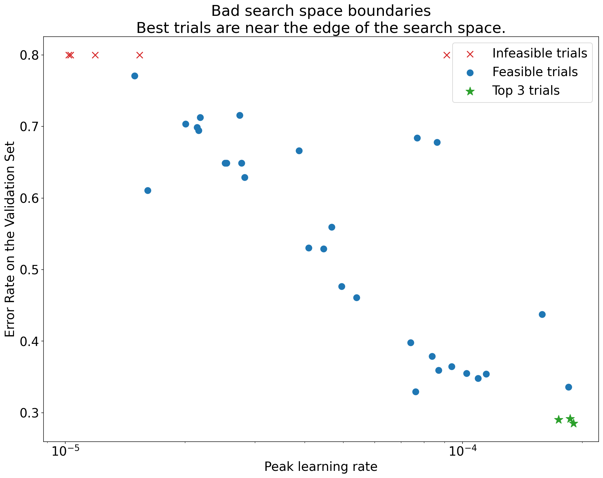
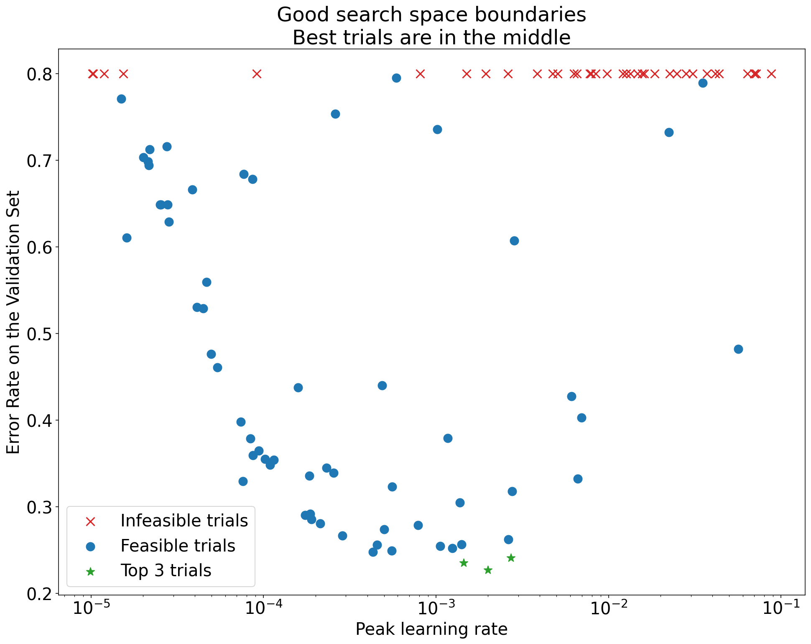
</p>

<p align="center"><b>図1:</b> 悪い探索空間の境界と許容される探索空間の境界の例．</p>

-   [図1](#figure-1)のプロットは，初期学習率に対するエラー率（低いほど良い）を示している．
-   もし最良の点が探索空間の端（ある次元）に集まっている場合，最良の観測点が境界の近くになくなるまで探索空間の境界を拡張する必要があるかもしれない．
-   しばしば，発散したり，非常に悪い結果を出したりする「実行不可能な」試行が含まれる（上のプロットでは赤いX印で示されている）．
    -   もしすべての試行がある閾値より大きい学習率で実行不可能であり，かつ最も性能の良い試行の学習率がその領域の端にある場合，モデルはより高い学習率にアクセスするのを妨げる安定性の問題に悩まされるかもしれない．

</details>

<a id="not-sampling-enough-points-in-the-search-space"></a>
#### 探索空間内の十分な点のサンプリングが行われていない

<details><summary><em>[Click to expand]</em></summary>

<br>

-   一般に，探索空間が十分に密にサンプリングされているかどうかを[知ることは非常に難しい場合があります](#how-many-trials-are-needed-to-get-good-results-with-quasi-random-search)．🤖
-   より多くの試行を行うことはもちろん良いことですが，それには明らかなコストがかかります．
-   十分なサンプリングができたかどうかを知るのは非常に難しいので，通常は余裕のあるサンプリングを行い，様々なハイパーパラメータ軸プロットを繰り返し見て，探索空間の「良い」領域にどれだけのポイントがあるのかを把握することで，直感的な信頼感を較正しようとするのです．

</details>

<a id="examining-the-training-curves"></a>
#### トレーニングカーブのバリデーション

***要約:*** *トレーニングカーブを調べることは，一般的な故障モードを特定する簡単な方法であり，次に取るべきアクションの優先順位を決めるのに役立ちます．*

-   多くの場合，実験の主目的は各試行のバリデーション誤差を考慮することであるが，各試行を1つの数字に還元することは，表面下で起こっていることについての重要な詳細を隠してしまう可能性があるため，注意する必要がある．
-   私たちは常に，少なくとも最良の数試行のトレーニングカーブ（トレーニング期間中のトレーニング誤差とバリデーション誤差をトレーニングステップに対してプロットしたもの）を見ています．
-   たとえそれが実験の目的にとって必要ないとしても，トレーニングカーブを調べることは，一般的な故障モードを特定する簡単な方法であり，次に取るべき処置の優先順位を決めるのに役立ちます．
-   トレーニングカーブを調べる際，我々は以下のような点に注目する．
-   過ぎるが発生している試行はあるか？
-   **過学習**は，トレーニング中にバリデーション誤差が増加し始めると発生します．
    -   科学的ハイパーパラメータの各設定に対して「最適」な試行を選択することによって，迷惑ハイパーパラメータを排除して最適化する実験環境では，少なくとも比較する科学的ハイパーパラメータの設定に対応する最適試行のそれぞれで問題のある過学習をチェックすべきです．
    -   最良の試行のいずれかが問題のある過学習を示した場合，通常，科学的ハイパーパラメータの値を比較する前に，追加の正則化技術で実験を再実行するか，既存の正則化パラメータをよりよく調整します．
        -   科学的ハイパーパラメータに正則化パラメータが含まれている場合，正則化パラメータの強度を低く設定すると，過学習の問題が発生してもおかしくないため，これは適用されない場合があります．
        -   過学習の低減は，コードの複雑さや余分な計算を最小限にする一般的な正則化技術（ドロップアウト，ラベルスムージング，ウェイト減衰など）を用いることで容易に行える場合が多く，通常，次の実験ラウンドにこれらの技術を1つ以上追加しても大きな問題はない．
        -   例えば，科学的ハイパーパラメータが「隠れ層の数」であり，最大の隠れ層を使用した最良の試行が問題のある過学習を示した場合，通常，すぐに小さい隠れ層数を選択するのではなく，追加の正則化で再試行することを好むだろう．
        -   「最良の」試行がどれも問題のある過学習を示さない場合でも，*いずれかの*試行で問題が発生した場合は，まだ問題がある可能性がある．
            -   最適な試行を選択することは，問題のある過学習を抑制し，そうでないものを優先することになる．つまり，より正則化された構成が有利になる．
            -   しかし，学習を悪化させるものは，たとえそれが意図されたものでなくても正則化として作用することがある．例えば，学習速度を小さくすると，最適化プロセスを阻害して学習を正則化することができますが，通常，このような学習速度の選択はしたくありません．
            -   したがって，科学的ハイパーパラメータの各設定に対する「最適」な試行が，科学的ハイパーパラメータや迷惑ハイパーパラメータの一部の「悪い」値を優先するような方法で選択される可能性があることを認識する必要があります．
-   トレーニングの後半で，トレーニングやバリデーション誤差のステップ間分散が大きくなることはありませんか？
    -   もしそうであれば，科学的ハイパーパラメータの異なる値を比較する能力（各試験が「ラッキー」または「アンラッキー」ステップでランダムに終了するため）と，本番で最良の試験の結果を再現する能力（本番モデルが試験と同じ「ラッキー」ステップで終了するとは限らないため）を妨害する可能性があります．
    -   ステップ間分散の最も可能性の高い原因は，バッチ間分散（バッチごとにトレーニングセットからランダムにサンプルを抽出することによる），小さなバリデーションセット，トレーニングの後半で高すぎる学習率を使用することです．
    -   改善策としては，バッチサイズを大きくする，バリデーションデータを増やす，学習率の減衰を利用する，ポリアク平均を利用する，などが考えられる．
-   トレーニングが終了した時点でも試行回数が増加していますか？
    -   もしそうなら，これは[「計算限界」領域](#Determining-the-number-of-steps-for-each-training-run)に入っていることを示しており，[トレーニングステップ数を増やす](#Deciding-how-long-to-train-when-training-is-compute-bound)か，学習率のスケジュールを変更することで効果が得られる可能性があります．
-   トレーニングセットとバリデーションセットの性能が，トレーニングの最終ステップのずっと前に飽和していませんか？
    -   もしそうであれば，[「計算限界に達していない」](#Determining-the-number-of-steps-for-each-training-run)状態であり，[トレーニングステップの数を減らす](#Deciding-how-long-to-train-when-training-is-not-compute-bound)ことができるかもしれません．
-   この他にも，トレーニングカーブを調べることで明らかになる現象は数多くあります（例えば，トレーニング中にトレーニングロスが増加する場合は，通常トレーニングパイプラインにバグがあることを示しています）．

</details>

<a id="detecting-whether-a-change-is-useful-with-isolation-plots"></a>
#### 分離プロットによる変更が有効かどうかの検出

<details><summary><em>[Click to expand]</em></summary>

<br>

<p align="center" id="figure-2">
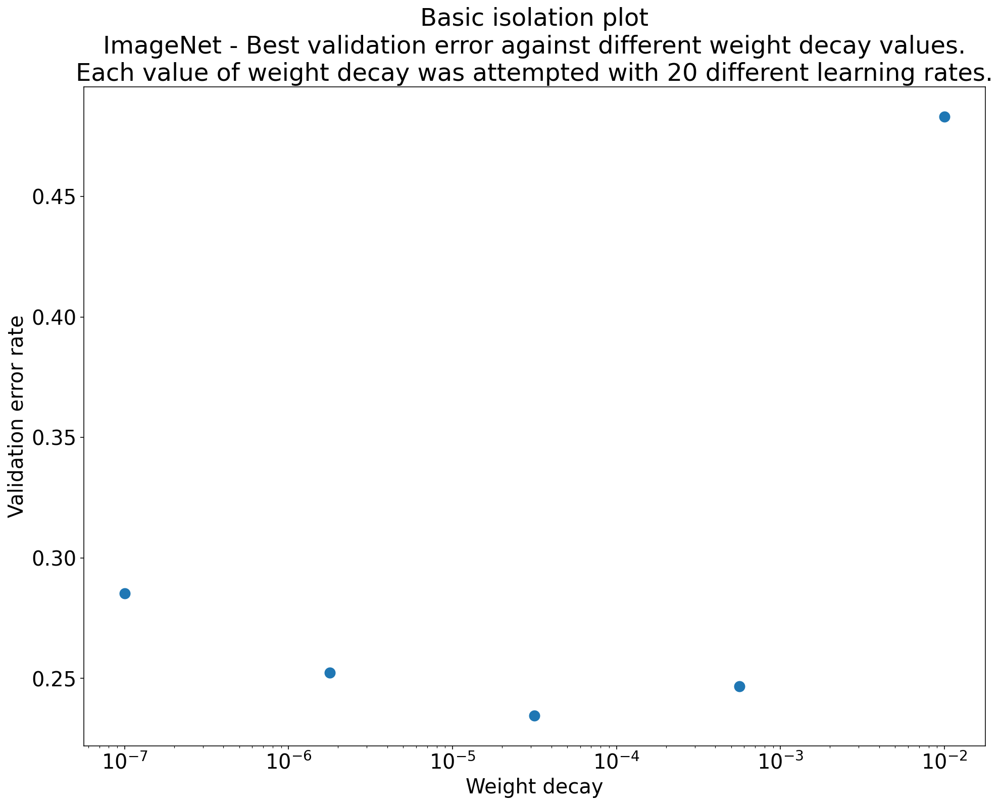
</p>

<p align="center"><b>図2:</b> ImageNetで学習したResNet-50の重み減衰の最適値を調査した分離プロット</p>

-   多くの場合，一連の実験の目的は，科学的ハイパーパラメータの異なる値を比較することである．
    -   例えば，最高のバリデーション誤差をもたらす重み減衰の値を決定したい場合があります．
-   **分離プロット**は，基本的なハイパーパラメータ軸プロットの特別なケースです．分離プロット上の各ポイントは，迷惑ハイパーパラメータの一部（またはすべて）にわたって，*最良*のトライアルのパフォーマンスに対応します．
    -   言い換えれば，迷惑ハイパーパラメータを「最適化」した後のモデル性能をプロットしているのです．
-   分離プロットにより，科学的ハイパーパラメータの異なる値間のリンゴ対リンゴの比較を簡単に行うことができます．
-   例えば，[図2](#figure-2)は，ImageNetで学習したResNet-50の特定の構成で，最高のバリデーション性能を生み出す重み減衰の値を明らかにします．
    -   もし我々の目的が Weight Decay を全く含まないかどうかを判断することであるなら，このプロットから最良の点を Weight Decay 無しのベースラインと比較することになる．公平に比較するためには，ベースラインの学習率も同様に調整する必要があります．
-   (擬似)ランダムサーチで生成されたデータがあり，分離プロットのための連続ハイパーパラメータを検討している場合，基本ハイパーパラメータ軸プロットのX軸の値をバケット化し，バケットで定義された各縦スライスで最良の試行を取ることにより分離プロットを近似することができます．

</details>

<a id="Automate-generically-useful-plots"></a>
#### 一般的に有用なプロットを自動化する

<details><summary><em>[Click to expand]</em></summary>

<br>

-   プロット生成に手間がかかればかかるほど，プロットをあまり見なくなります．したがって，できるだけ多くのプロットを自動的に生成するようにインフラをセットアップするのが得策です．
-   少なくとも，実験で変化させたすべてのハイパーパラメータについて，基本的なハイパーパラメータ軸のプロットを自動的に生成します．
-   さらに，すべてのトライアルについてトレーニングカーブを自動的に作成し，各スタディのベストトライアルをできるだけ簡単に見つけ，そのトレーニングカーブを調べることができるようにします．
-   その他にも，有用なプロットや可視化を追加できる可能性があります．上記のものは良い出発点ですが，Geoffrey Hintonの言葉を借りれば，"Every time you plot something new, you learn something new."（新しいものを描くたびに，新しいことを学ぶ）です．

</details>


<a id="Determining-whether-to-adopt-a-training-pipeline-change-or-hyperparameter-configuration"></a>
### 学習パイプラインの変更やハイパーパラメータの設定を採用するかどうかの判断

***要約:*** *今後，モデルや学習方法を変更するか，新しいハイパーパラメータ設定を採用するかを決定する際には，結果のばらつきのさまざまな原因を認識する必要があります．*

-   モデルを改善しようとするとき，ある特定の変更候補が，当初は既存の構成と比較してより良いバリデーション誤差を達成しているが，実験を繰り返した結果，一貫した利点がないことに気づくかもしれません．非公式には，このような一貫性のない結果を引き起こす可能性のある最も重要な変動要因を，次のような大きなカテゴリーに分類することができます．
    -   **学習手順分散**，**再学習分散**，または**試行分散**：同じハイパーパラメータを使用しても，異なるランダムシードを使用した学習実行の間で見られる変動です．
        -   例えば，ランダムな初期化，学習データのシャッフル，ドロップアウトマスク，データ拡張操作のパターン，並列演算操作の順序の違いは，すべて試行分散の原因となる可能性があります．
    -   **ハイパーパラメータ探索のばらつき**，または**スタディのばらつき**：ハイパーパラメータを選択する手順によって生じる結果のばらつき．
        -   例えば，ある特定の探索空間で同じ実験を行うが，準ランダム探索のために2つの異なる種を用いて，最終的に異なるハイパーパラメータ値を選択する場合がある．
    -   **データ収集とサンプリングの分散**：トレーニング，バリデーション，テストデータにランダムに分割されることによる分散，またはより一般的なトレーニングデータ生成プロセスによる分散．
-   有限のバリデーションセットで推定されたバリデーション誤差を，綿密な統計検定で比較するのは良いことですが，同じハイパーパラメータ設定を使用した2つの異なる学習モデル間で，試験の分散だけで統計的に有意な差が生じることがよくあります．
-   ハイパーパラメータ空間における個々の点のレベルを超えた結論を出そうとするとき，我々は試験の分散を最も気にします．
    -   学習分散は試行回数と探索空間に依存し，試行分散より大きい場合もあれば，かなり小さい場合も見られます．
-   したがって，変更候補を採用する前に，最適な試行をN回実行して，実行間試行分散を特徴付けることを検討する．
    -   通常，パイプラインに大きな変更があった場合，試行分散の再特性化だけで済みますが，アプリケーションによっては，より新鮮な推定値が必要になる場合があります．
    -   他のアプリケーションでは，試行錯誤の分散を特徴付けることは，コストがかかりすぎて割に合いません．
-   結局のところ，我々は真の改善をもたらす変更（新しいハイパーパラメータ構成を含む）だけを採用したいのですが，何かが役立つという完全な確信を求めることも正しい答えではありません．
-   したがって，新しいハイパーパラメータポイント（またはその他の変更）がベースラインよりも良い結果を得た場合（新しいポイントとベースラインの両方の再トレーニング分散をできる限り考慮），おそらくそれを将来の比較のための新しいベースラインとして採用すべきです．
    -   しかし，私たちが採用すべきなのは，その変更によって追加される複雑さを上回る改善をもたらす変更だけです．


<a id="After-exploration-concludes"></a>
### 探索終了後

***要約:*** *ベイズ最適化ツールは，良い探索空間の探索が終わり，どのハイパーパラメータをチューニングすべきかを決定した時点で，説得力のある選択肢となります．*

-   ある時点で，私たちの優先順位は，調整問題についての学習から，打ち上げまたはその他の方法で使用する単一の最適な構成を生成することに移行します．
-   この時点では，最適に観測された試行の局所領域を快適に含み，十分にサンプリングされた精緻な探索空間が存在するはずです．
-   この探索作業により，調整すべき最も重要なハイパーパラメータ（およびその妥当な範囲）が明らかになり，できるだけ大きな調整予算を使った最終的な自動調整研究のための探索空間を構築するために使用できるはずです．
-   チューニング問題に対する我々の洞察を最大化することにもはや関心がないので，[準ランダム探索の利点](#why-use-quasi-random-search-instead-of-more-sophisticated-black-box-optimization-algorithms-during-the-exploration-phase-of-tuning)の多くはもはや適用されず，ベイズ最適化ツールを使用して最適なハイパーパラメータ構成を自動的に見つける必要があります．
    -   探索空間に発散点（学習損失がNaNになる点，あるいは学習損失が平均より何標準偏差も悪くなる点）が自明ではない量含まれる場合，発散する試行を適切に処理するブラックボックス最適化ツールを用いることが重要です（この問題に対処する優れた方法として，[未知の制約を持つベイズ最適化](https://arxiv.org/abs/1403.5607)を参照して下さい）．
-   この時点で，テストセットでの性能を確認することも検討する必要があります．
    -   原理的には，バリデーションセットをトレーニングセットに折り込み，ベイズ最適化で見つかった最適な構成を再トレーニングすることも可能です．しかし，これは，この特定の作業負荷で将来起動することがない場合にのみ適切です（例えば，1回限りのKaggleコンペティションなど）．

<a id="Determining-the-number-of-steps-for-each-training-run"></a>
### 各学習実行のステップ数の決定

-   ワークロードには，計算負荷型がある場合とそうでない場合があります．
-   **計算負荷がある**場合，学習は，学習データの量や他の要因ではなく，どれだけ待つことができるかによって制限されます．
    -   この場合，より長く，あるいはより効率的に学習を行うことができれば，学習損失は減少し，適切なチューニングによりバリデーション損失も改善されるはずです．
    -   つまり，学習を*高速化*することは，学習を*改善*することと同じであり，"最適な"学習時間は常に "余裕がある場合"に限られるのである．
    -   とはいえ，ワークロードが計算量に制限されているからといって，学習を長く/速くすることが結果を向上させる唯一の方法であるとは限りません．
-   **計算負荷がない**場合，ある時点で，長く訓練してもあまり効果がない（あるいは，過学習の原因になる）ことがあります．
    -   このような場合，学習損失が非常に小さくなり，学習損失はわずかに減少するが，バリデーション損失は有意に減少しないことが予想されます．
    -   特に，学習が計算量に制限されない場合，学習時間予算が多ければ多いほど，チューニングが容易になります．特に，学習率減衰スケジュールは学習予算と特に強い相互作用があるため，チューニングが容易になります．
        -   言い換えれば，学習時間バジェットが非常に少ない場合，良好なエラーレートを達成するためには，学習率減衰スケジュールを完璧なまでに調整する必要があります．
-   計算量に制約があるかどうかに関わらず，勾配の分散を大きくする方法は，通常，学習の進捗を遅くし，特定のバリデーション損失に到達するために必要な学習ステップの数を増加させる可能性があります．勾配の分散が大きくなる原因としては，以下のようなことが考えられます．
    -   より小さいバッチサイズを使用する
    -   データ補強の追加
    -   正則化の追加（例：ドロップアウト）


<a id="Deciding-how-long-to-train-when-training-is-not-compute-bound"></a>
### 訓練が計算機バウンドしない場合の訓練時間の決定

-   我々の主な目標は，モデルが最良の結果を得るために十分な時間をかけてトレーニングすることであり，同時にトレーニングステップの数に無駄がないようにすることです．
-   疑問がある場合は，より長くトレーニングする側に立ちましょう．遡及的（最適）なチェックポイント選択が適切に行われ，チェックポイントが十分頻繁に行われていれば，長く訓練してもパフォーマンスが落ちることはないはずです．
-   `max_train_steps`は決して調整しないでください．ある値を選び，それをすべてのトライアルに使用します．これらのトライアルから，`max_train_steps`の選択を改良するために，遡及的（最適）なチェックポイント選択が発見したトレーニングステップをプロットします．
    -   例えば，最適なステップが常にトレーニングの最初の10％である場合，最大ステップ数は高すぎます．
    -   また，最適なステップが常にトレーニングの最後の25%にある場合，トレーニングを長くして減衰スケジュールを再チューニングすることが有効かもしれません．
-   理想的なトレーニングステップ数は，アーキテクチャやデータが変更された場合（例：データ拡張の追加）にも変更可能です．
-   以下では，一定の学習率を用いてトレーニングセットを「完全に適合」させるために必要なステップ数に基づいて，`max_train_steps`の初期値の候補を選ぶ方法を説明します．
    -   注意：「トレーニングセットに完全に適合する」という表現は，正確な，あるいは数学的に明確に定義された方法で使用しているわけではありません．単に，学習損失が非常に少ないことを示す非公式な表現である．
        -   例えば，正則化項のない対数損失で学習する場合，ネットワークの重みが際限なく増加し，学習セットに対するモデルの予測がますます確実になってくると，学習損失は浮動小数点限界に達するまでゆっくりと改善し続けることがあります．この場合，トレーニングセットでの誤判別誤差がゼロになった時点で，モデルがトレーニングセットに「完全に適合」したと言えるかもしれません．
    -   学習手順中の勾配ノイズが増加した場合，`max_train_steps`の開始値を増加させる必要があるかもしれません．
        -   例えば，データ補強やドロップアウトのような正則化がモデルに導入された場合です．
    -   また，学習プロセスの改善により，max_train_stepsを減少させることができるかもしれません．
        -   例えば，オプティマイザーのチューニングや学習率スケジュールのチューニングを改善した場合などである．

<a id="Algorithm-for-picking-an-initial-candidate-for-max_train_steps-using-a-learning-rate-sweep"></a>
#### 学習率スイープを用いたmax_train_stepsの初期候補を選ぶためのアルゴリズム

<details><summary><em>[Click to expand]</em></summary>

<br>

-   この手順では，トレーニングセットを「完全に」適合させるだけでなく，一定の学習率で適合させることも可能であると仮定している．
-   もしトレーニングセット全体を完全にフィットさせることが可能であれば，トレーニングセットに完全にフィットする設定（`max_train_steps`の値がある）が存在するはずである．そのような構成を見つけ，その`max_train_steps`の値を開始点`N`として使用します．
-   データ補強や正則化を行わず，各試行が`N`ステップで学習するように，一定の学習率スイープ（すなわち，学習率のグリッドサーチ）を実行する．
-   スイープの中で最も速い試行が完璧な学習性能に到達するために必要なステップ数が，`max_train_steps` の初期推測値である．
-   **注意：**探索空間が悪いと，自己欺瞞に陥る可能性がある．
    -   例えば，ある研究のすべての学習率が小さすぎる場合，`max_train_steps`の値を非常に大きくする必要があると誤って結論づけることがあります．
    -   最低限，学習における最適な学習率が探索空間の境界にないことを確認する必要がある．

</details>


<a id="Deciding-how-long-to-train-when-training-is-compute-bound"></a>
### 学習が計算機バウンドする場合の学習時間を決める

-   場合によっては，トレーニングロスがいつまでも改善されず，我々の忍耐力と計算機資源が限界になることがあります．
-   もし，学習損失（あるいはバリデーション損失）が無限に改善し続けるのであれば，我々は常に余裕のある限り学習を続けるべきでしょうか？そうとは限りません．
    -   より多くの短い実験を行い，最も長い "production length"の実験は，発売を予定しているモデルのためにとっておくことで，より効果的なチューニングが可能になるかもしれません．
    -   トライアルのトレーニング時間が我慢の限界に近づくにつれ，チューニング実験が打ち上げ候補のモデルにとってより重要になりますが，完了できる実験の数は少なくなります．
    -   しかし，この制限時間での結論は，100%はおろか，20%の実験にも適用されないというリスクが常にあります．
-   トレーニングのステップ制限を増やしながら，複数のラウンドでチューニングを行うのは，賢明なアプローチと言えます．
    -   何周でもできますが，通常は1〜3周が最も実用的です．
    -   基本的に，非常に速いターンアラウンドタイムで試行し，チューニングの徹底と最終的な最長ランとの関連性をトレードオフしながら，できるだけ多くの問題理解を得ようとします．
    -   試行回数に制限を設けて有用な知見が得られたら，学習時間を増やしてチューニングを続け，必要に応じて短い試行回数で得た結論を再確認することができます．
-   まずは，2回のチューニングを行うことをお勧めします．
    -   ラウンド1: 短い実行時間で，良いモデルおよびオプティマイザのハイパーパラメータを見つけます．
    -   ラウンド2：最終的なモデルを得るために，良いハイパーパラメータポイントで非常に少数の長い実行を行います．
-   `ラウンドi`から`ラウンドi+1`へ移行する際の最大の問題は，学習率の減衰スケジュールをどのように調整するかということです．
    -   ラウンド間で学習率スケジュールを調整する際によくある落とし穴は，小さすぎる学習率で余分な学習ステップをすべて使ってしまうことです．

#### ラウンド1

<details><summary><em>[Click to expand]</em></summary>

<br>

-   残念ながら，短時間の不完全な訓練で見つかった良いハイパーパラメータが，訓練の長さが大幅に増加したときにも良い選択であるという保証はどこにもないのです．しかし，ハイパーパラメータの種類によっては，ラウンド1でも十分に相関があることが多いのです．
-   どのようなハイパーパラメータが，短い訓練で発見され，長い訓練に移行することが期待できるのでしょうか？これら全てについて，さらなる研究が必要です．しかし，これまでに分かっていることに基づいて，移行の確率が低い順に著者の疑いを紹介します．
    -   移行する可能性が非常に高い
        -   初期の学習不安定性は，より少ない数の学習ステップを用いた最初のチューニングで解決することができる．おそらく，これらのハイパーパラメータが最も確実な移行の可能性に近いと思われる．
            -   ウォームアップの長さ
            -   初期化
    -   移行の可能性が高い
        -   モデルアーキテクチャ: モデルアーキテクチャの劇的にうまく行く場合は，通常，移行されますが，おそらく多くの反例があると思われます．
    -   移行する可能性がある
        -   最適化アルゴリズム/最適化ハイパーパラメータ: これは「緩やかに」移行すると思われます．これは，上記のものよりも確実に弱いです．
        -   データ拡張
        -   正規化
            -   トレーニングセットに完全にフィットしない場合，モデルは正則化があまり役に立たない領域にある可能性があります．
    -   移行の可能性が低い
        -   学習率スケジュール: 完全に移行する可能性は低い．
            -  [この論文](https://arxiv.org/abs/2203.15556)では減衰スケジュールでも転送されることを示唆しているが，一般的にはそうでないと考えている．例：学習ステップ数が少ないときにsqrt decayを調整し，その後大きなステップ数に拡張すると，学習の大部分が過度に小さなステップ数で行われることになる．
               -  極端なトレーニングバジェットの制限内では，ほとんどのスケジュールで "good enough"になる可能性がありますが，チューニングすれば顕著な性能向上が見られると思われます．
             -  [Understanding Short-Horizon Bias in Stochastic Meta-Optimization](https://arxiv.org/abs/1803.02021) は，近視眼的に学習率を選択しようとすることの危険性について述べています．

</details>

#### ラウンド2

<details><summary><em>[Click to expand]</em></summary>

<br>

-   ラウンド1の最適なハイパーパラメータ設定を実行する．
-   **(推測)** 🤖 余分なステップを利用して，高い学習率で学習する期間を延長する．
    -   例：線形スケジュールなら，減衰の長さをRound1から固定にして，最初は学習率を一定にした期間を延長する．
    -   コサイン減衰の場合は，[Chinchilla paper](https://arxiv.org/abs/2203.15556)と同様に，ラウンド1から基本の学習率を維持し，`max_train_steps`を延長するだけでよい．
-   モデリングとチューニングのパイプラインが非常に成熟しており，実機でのトレーニングが非常に長く高価なチームでは，ラウンド数を増やすことは意味があるかもしれませんが，多くの場合，やりすぎでしょう．
    -   ここまで，ステップ1→ステップ2への移行方法について説明してきました．もし，解析時間を気にせず，計算を効率的に使用することが最大の関心事であるならば，理想的なのは，チューニングの多くの異なるラウンドでトレーニング実行の長さ（したがって，研究を完了するためのエンドツーエンドの時間）を指数関数的に増加させることでしょう．
        -   各ラウンドで，私たちが選択したものが引き続き有効であることを体系的に確認します．
        -   新しいアイデアは，ステップiからステップi+1まで，次第に長くなる実験を用いて，徐々に派生していくパイプラインを通過する．

</details>


<a id="Additional-guidance-for-the-training-pipeline"></a>
## 学習パイプラインの追加ガイダンス

<a id="Optimizing-the-input-pipeline"></a>
### 入力パイプラインの最適化

***要約:*** *入力バウンドパイプラインの原因と対策は，タスクに大きく依存します．プロファイラを使用して，よくある問題に目を向けてください．*

-   入力バウンドパイプラインの診断には，適切なプロファイラーを使用します．例えば，JAXなら[Perfetto](https://jax.readthedocs.io/en/latest/profiling.html) ，TensorFlowなら[TensorFlow profiler](https://www.tensorflow.org/guide/profiler)など．
-   最終的に，具体的な原因や介入方法は，タスクに大きく依存することになる．広範なエンジニアリングの考慮事項（ディスクフットプリントを最小化するなど）は，入力パイプラインの性能の悪化を保証する場合があります．
-   一般的な原因
    -   データがトレーニングプロセスと一緒に配置されていないため，I/Oレイテンシーが発生する（ネットワーク経由でトレーニングデータを読み込む際に発生する可能性がある）．
    -   オンラインデータ前処理にコストがかかっている．
    -   データパイプラインのプリフェッチに干渉する意図しない同期バリア．例えば，CommonLoopUtils([link](https://github.com/google/CommonLoopUtils/blob/fea2518ada8814a78e1492023fd9f00edb0b0568/clu/metrics.py#L291))でデバイスとホスト間の評価指標を同期させる場合など．
-   一般的なヒント．
    -   機器入力パイプラインをプリフェッチする例（例：[tf.data.Dataset.prefetch](https://www.tensorflow.org/guide/data_performance#prefetching)）
    -   パイプラインのできるだけ早い段階で，それぞれから未使用の機能/メタデータを削除する．
    -   入力パイプラインのサンプルを生成するジョブ数のレプリケーションを増やす．例えば，[tf.data service](https://www.tensorflow.org/api_docs/python/tf/data/experimental/service)を利用することで．


<a id="Evaluating-model-performance"></a>
### モデル性能の評価

***要約:*** *トレーニングよりも大きなバッチサイズで評価を実行する．時間間隔ではなく，一定のステップ間隔で評価を実行する．*

#### 評価設定

<details><summary><em>[Click to expand]</em></summary>

<br>

-   モデルのパフォーマンスを評価するには，いくつかの設定があります．
    -   **オンライン評価**: 評価指標は，モデルが実運用環境で予測を提供するときに収集されます．
    -   **オフライン評価**: 本番環境を代表するオフラインの訓練/バリデーション/テスト・セットでモデルを実行したときに，評価指標が収集されます．
    -   **定期的な評価**: 評価指標は，オフライン評価の代理となるモデルのトレーニング中や，オフライン評価で使用されたデータのサブセットで収集されます．
-   オンライン評価はゴールドスタンダードであるが，モデル開発段階では現実的でないことが多い．
-   問題によっては，オフライン評価はかなり複雑で，計算コストがかかる場合があります．
-   定期的な評価は最も実用的で経済的な選択ですが，実稼働環境を完全に表現できない場合があります．
    -   定期的な評価では，トレーニング中に得られる信号の信頼性を犠牲にすることなく，オフライン評価の簡便なプロキシを使用することを目標としています．

</details>

#### 定期的な評価の設定

<details><summary><em>[Click to expand]</em></summary>

<br>

-   トレーニング中に定期的な評価を行うことで，トレーニングの進捗をリアルタイムに監視し，[レトロスペクティブなモデルのチェックポイント選択](#Saving-checkpoints-and-retrospectively-selecting-the-best-checkpoint)を容易にし，[トレーニング終了時にトレーニングカーブを検証](#examining-the-training-curves)できるようにします．
-   最も単純な構成は，トレーニングと定期的な評価の両方を同じ計算インスタンス内で行い，トレーニングと評価を周期的に交互に行うものです．
    -   この場合，評価時にモデルのアクティブ度を維持する必要がないため，評価のためのバッチサイズは少なくともトレーニング時のバッチサイズと同程度にする必要があり，1例あたりの計算量が少なくなります．
-   定期的な評価は，時間間隔ではなく，一定のステップ間隔で行う必要があります．
    -   時間間隔に基づいて評価すると，トレーニングカーブの解釈が難しくなります．特に，トレーニングジョブの先送り，ネットワークの遅延の問題などが発生する可能性があります．
-   バリデーション/テスト評価指標の周期性（シャッフルされたトレイン/バリデーション/テスト分割を使用する場合）は，テストデータがトレインデータと重複している，またはトレインデータが適切にシャッフルされていないなどの実装上のバグを示すことがあります．一定のステップ間隔で評価することで，これらの問題を容易に発見することができます．
-   評価セットがバッチサイズで割り切れない場合，パーシャルバッチが発生することがあります．損失関数にバイアスがかからないように，パディングされたサンプルは正しく重み付けされていることを確認してください．多くの場合，これらのパディングされた例には，ゼロの重みを与えることができます．
-   オフライン分析をサポートするために，評価ごとに十分な情報を保存する．理想的には，個々の例の選択に関する予測を保存することで，デバッグに非常に役立つからです．
    -   [SavedModels](https://www.tensorflow.org/guide/saved_model)のような成果物を生成することで，評価ジョブが終了した後にアドホックなモデル検査を容易に行うことができます．

</details>

#### 定期的な評価用サンプルの選択

<details><summary><em>[Click to expand]</em></summary>

<br>

-   定期評価ジョブは，オフライン評価セット全体の評価指標を合理的な時間で計算できるほど高速に実行できない場合があります．このため，定期的な評価のためにデータのサンプリングが必要になることがよくあります．
-   サンプリングされたデータセットを構築する際には，以下の要因を考慮します．
    -   <ins>サンプルサイズ</ins>
        -   定期的なジョブが使用するサンプルデータセットで計算された性能が，オフライン評価セット全体の性能と一致すること，つまりサンプルセットとデータセット全体の間に偏りがないことを確認する．
        -   定期的な評価に使用するデータセットは，その全体にわたってモデル予測を生成することが容易なほど十分に小さく，しかしモデルの改善を正確に測定できるほど十分に大きい（すなわち，ラベルノイズに圧倒されない）ことが必要です．
        -   また，このような評価を複数の試行にわたって順番に行い，なおかつ正確な推定値が得られるような大きさである必要がある．つまり，時間経過とともにバリデーションセットに適応的に「フィット」してしまい，保持されたテストセットに一般化されないことを避けるためである．しかし，このような懸念は現実的にはほとんどありません．
    -   <ins>アンバランスなデータセット</ins>
        -   不均衡なデータセットでは，稀なクラスの例に対する性能がノイズとなることが多い．
        -   クラスラベルの例数が少ないデータセットでは，正しく予測された例数をログに記録して，精度の向上をより深く理解します（.05の感度向上というとよく聞こえますが，正しい例数が1つ増えただけなのではないしょうか？）．

</details>

<a id="Saving-checkpoints-and-retrospectively-selecting-the-best-checkpoint"></a>
### チェックポイントの保存と最適なチェックポイントの遡及選択

***要約:*** *一定のステップ数でトレーニングを実行し，その中から最適なチェックポイントを遡及的に選択します．*

-   ほとんどの深層学習フレームワークは，[モデルのチェックポイント](https://flax.readthedocs.io/en/latest/api_reference/flax.training.html)をサポートしています．つまり，モデルの現在の状態が定期的にディスクに保存されます．これにより，トレーニングジョブは計算インスタンスの中断に対して弾力的になることができます．
-   特に，バリデーションセットの性能が時間とともに上がり続けるのではなく，特定の値で変動している場合，最適なチェックポイントは最後のチェックポイントではないことが多いのです．
-   パイプラインを設定し，トレーニング中にこれまでに見たN個の最良チェックポイントを記録します．トレーニングが終了した時点で，モデル選択はトレーニング中に見た最適なチェックポイントを選択することになります．これを**retrospective optimal checkpoint selection**と呼びます．
-   試験予算をあらかじめ指定し，これまでに見た最適なN個のチェックポイントを保存しているため，前向きな早期停止をサポートすることは通常必要ではありません．


<a id="Setting-up-experiment-tracking"></a>
### 実験追跡の設定

***要約:*** *異なる実験を追跡する場合，その研究でのチェックポイントの最高のパフォーマンスや，研究の短い説明など，多くのエッセンスを必ず記録してください．*

-  私たちは，実験結果をスプレッドシートに記録しておくと，これまで取り組んできたようなモデリングの問題に役立つことを発見しました．以下のような列を持つことが多いです．
   -  試験名
   -  その研究のコンフィグが保存されている場所へのリンク．
   -  研究のメモや簡単な説明
   -  実行した試行回数
   -  その研究で最も優れたチェックポイントのバリデーションセットにおけるパフォーマンス．
   -  具体的な再現コマンド，またはトレーニングを開始するために必要な未提出の変更点に関するメモ．
-  少なくとも上記の情報を取得し，それを行う人々にとって便利な追跡システムを見つけること．追跡されていない実験は，存在しないのと同じかもしれません．

<a id="Batch-normalization-implementation-details"></a>
### バッチノーマライズの実装詳細

***要約:*** *現在ではバッチノルムをレイヤーノルムに置き換えることができる場合が多いが，そうできない場合，バッチサイズやホスト数を変更する際に厄介な点がある．*

-  バッチノルムは現在のバッチの平均と分散を使用してアクティブを正規化しますが，マルチデバイスの設定では，明示的に同期されない限り，これらの統計は各デバイスで異なっています．
-  （主にImageNetに関する）報告によると，実際には64例のみを使用してこれらの正規化統計量を計算する方がうまくいくそうです（[この論文](https://arxiv.org/abs/1705.08741)のGhost Batch Normを参照）．
-  バッチサイズとバッチノルムの統計量を計算するための例数を切り離すと，バッチサイズの比較に特に有効です．
-  ゴーストバッチノルムの実装は，デバイスごとのバッチサイズ > 仮想バッチサイズの場合を必ずしも正しく処理しません．この場合，バッチノルム統計量の適切な数の例を得るために，実際には各デバイス上でバッチをサブサンプリングする必要があります．
-  テストモードバッチノルムで使用される指数移動平均は，学習統計量の線形結合に過ぎないので，これらのEMAはチェックポイントに保存する前に同期させるだけで良いのです．しかし，バッチノルムの一般的な実装では，これらのEMAの同期を行わず，最初のデバイスからのEMAのみを保存するものもあります．


<a id="Considerations-for-multi-host-pipelines"></a>
### マルチホストパイプラインの注意点

***要約:*** *ロギング，評価，RNG，チェックポイント，データシャーディングなど，マルチホストトレーニングは，バグを誘発しやすくなります．*

-  パイプラインが1つのホストでのみログとチェックポイントを実行していることを確認します．
-  評価やチェックポイントが実行される前に，バッチノルムの統計がホスト間で同期されていることを確認します．
-  ホスト間で同じRNGシード（モデル初期化用）とホスト間で異なるシード（データシャッフリング/前処理用）を持つことが重要なので，それらを適切にマークすることを確認してください．
-  データファイルをホスト間でシャーディングすることは，通常，性能向上のために推奨されます．


<a id="faqs"></a>
## よくある質問

### 最適な学習率減衰スケジュール集合とは？

<details><summary><em>[Click to expand]</em></summary>

<br>

-   これは未解決の問題です．学習率の減衰スケジュールが「最善」であることを確信できる厳密な実験のセットをどのように構築するかは明らかではない．
-   我々は，最適なスケジュール集合を知らないが，何らかの（一定でない）スケジュールを持つことが重要であり，それを調整することが重要であることを確信している．
-   最適化プロセスにおいて，異なる学習速度が異なる時期に最も効果的に働きます．ある種のスケジュールを持つことで，モデルが良い学習速度に到達する可能性が高くなります．

</details>


### デフォルトでどの学習率減衰を使用すればよいですか？

<details><summary><em>[Click to expand]</em></summary>

<br>

-   私たちの好みはlinear decayかcosine decayですが，他のスケジュール集合も良いでしょう．

</details>


### なぜ論文によっては，学習率スケジュールが複雑なのですか？

<details><summary><em>[Click to expand]</em></summary>

<br>

-   複雑な区分けされた学習率減衰スケジュールを持つ論文を見ることは珍しいことではない．
-   読者はしばしば，著者がどのようにしてそのような複雑な研究にたどり着いたのか不思議に思う．
-   多くの複雑な学習率減衰スケジュールは，バリデーションセットの性能の関数として，以下の様にスケジュールをアドホックにチューニングした結果です．
    1. 単純な学習率減衰（または一定の学習率）で1回の学習を開始する．
    2. パフォーマンスが低下するまで学習を継続する．この場合，トレーニングを一時停止します．この時点から，おそらくより急な学習率減衰スケジュール（またはより小さな一定の学習レート）でトレーニングを再開する．このプロセスを会議／発売の締め切りまで繰り返す．
 -   結果として得られるスケジュールをそのままコピーすることは，一般的に良いアイデアとは言えません．なぜなら，最適な特定のスケジュールは，他の多くのハイパーパラメータの選択に対して敏感だからです．
     -   スケジュールを生成したアルゴリズムをコピーするのがベターですが，人間の恣意的な判断でスケジュールを生成した場合は，これが可能なことは稀です．
 -   このようなバリデーションエラーに敏感なスケジュールは，完全に自動化できるのであれば使用しても問題ありませんが，バリデーションエラーの関数である人間ループのスケジュールはもろく，簡単に再現できないので，避けることをお勧めします．
     -   このようなスケジュールを使用した結果を公表する前に，十分に再現性を持たせるように努めてください．

</details>


<a id="how-should-adams-hyperparameters-be-tuned"></a>
### Adamのハイパーパラメータはどのように調整されるべきか？

<details><summary><em>[Click to expand]</em></summary>

<br>

-   上述したように，探索空間や探索空間からいくつの点をサンプリングすべきかについて一般的な記述をすることは非常に困難である．Adamのすべてのハイパーパラメータが同じように重要であるわけではないことに注意してください．以下の経験則は，研究の試行回数の異なる「予算」に対応するものです．
    -   試行回数が10回未満の場合は，（基本）学習率のみを調整する．
    -   10-25試行の場合，学習速度と $\beta_1$を調整する．
    -   25回以上の試行がある場合は，学習率と $\beta_1$， $\epsilon$を調整する．
    -   25回以上の試行が可能であれば，さらに $\beta_2$を調整する．

</details>

<a id="why-use-quasi-random-search-instead-of-more-sophisticated-black-box-optimization-algorithms-during-the-exploration-phase-of-tuning"></a>
### チューニングの探索段階で，より洗練されたブラックボックス最適化アルゴリズムではなく，なぜ準ランダム探索を使うのでしょうか？

<details><summary><em>[Click to expand]</em></summary>

<br>

-   準ランダム探索（[不一致の少ないシーケンス](https://en.wikipedia.org/wiki/Low-discrepancy_sequence)に基づく）は，チューニング問題を最大限に理解することを目的とした反復チューニングプロセスの一部として使用する場合（私たちは「探索フェーズ」と呼んでいます），派手なブラックボックス最適化ツールよりも私たちの好みとなります．ベイズ最適化および類似のツールは，探索フェーズにより適しています．
-   ランダムにシフトされた低不連続度シーケンスに基づく準ランダム探索は，与えられた探索空間を一様に，しかしランダムに探索し，ランダム探索よりも探索点を広げることから，「ジッタード・シャッフル格子探索」と考えることができる．
-   より洗練されたブラックボックス最適化ツール（ベイズ最適化，進化的アルゴリズムなど）に対する準ランダム探索の利点は以下の通りです．
    1.  探索空間を非適応的にサンプリングすることで，実験を再実行することなく，ポストホック分析でチューニングの目的を変更することが可能になります．
        -   例えば，我々は通常，学習のどの時点でも達成される検証誤差の観点から最適な試行を見つけたいと思う．しかし，準ランダム探索の非適応性により，最終的な検証誤差，訓練誤差，あるいは別の評価指標に基づいて最適な試行を見つけることが，実験を再実行することなく可能になる．
    2.   準ランダムサーチは一貫性があり，統計的に再現可能な方法で動作する．
        -   探索アルゴリズムの実装が変わっても，同じ一様性の特性を維持する限り，6ヶ月前の研究を再現することが可能なはずです．高度なベイズ最適化ソフトウェアを使用している場合，バージョン間で実装が重要な形で変更される可能性があり，古い検索を再現することが非常に難しくなります．また，最適化ツールがサービスとして稼働している場合など，古い実装にロールバックすることが常に可能とは限りません．
    3.   探索空間を均一に探索することで，結果や探索空間に関する示唆を容易に推論することができます．
        -   例えば，準ランダム探索のトラバーサルにおける最良のポイントが探索空間の境界にある場合，これは探索空間の境界を変更すべきであるという良いシグナルです（ただし，確実ではありません）．[このセクション](#identifying-bad-search-space-boundaries)では，さらに深く掘り下げます．しかし，適応型ブラックボックス最適化アルゴリズムでは，同じように良い点を含んでいても，初期の試行が不運だったために探索空間の真ん中が無視されることがあります．
    4.   準ランダム探索（または他の非適応探索アルゴリズム）を使用する場合，適応型アルゴリズムとは異なり，異なる数の試行を並列に実行しても，統計的に異なる結果が得られることはありません．
    5.   より洗練された探索アルゴリズムは，特にニューラルネットワークのハイパーパラメータのチューニングを念頭に置いて設計されていない場合，実行不可能な点を必ずしも正しく扱えないことがあります．
    6.   準ランダム探索はシンプルで，多くのチューニング試行を並行して行う場合に特に効果的です．
        -   特に多くの試行を並行して行う必要がある場合，適応アルゴリズムがその2倍の予算を持つ準ランダム探索に勝つのは非常に難しい（したがって，新しい試行を開始する際に以前の試行結果を利用する機会はほとんどない），という逸話がある[^3]．
        -   ベイズ最適化などの高度なブラックボックス最適化手法の専門知識がなければ，原理的には提供できるはずのメリットが得られないかもしれません．現実的な深層学習のチューニング条件で，高度なブラックボックス最適化アルゴリズムをベンチマークすることは困難である．これらは現在の研究において非常に活発な分野であり，より洗練されたアルゴリズムには，経験の浅いユーザーにとってそれなりの落とし穴があるのです．これらの手法の専門家は良い結果を得ることができますが，高並列の条件では探索空間と予算がより重要になる傾向があります．
-   つまり，計算機資源が少数の試行しか並列に実行できず，多くの試行を順番に実行する余裕がある場合，ベイズ最適化はチューニング結果の解釈が難しくなるにもかかわらず，より魅力的になるのです．

[^3]: Ben RechtとKevin Jamiesonは，2倍予算のランダム探索がベースラインとしていかに強いかを[指摘](http://www.argmin.net/2016/06/20/hypertuning/)しましたが（[Hyperbandの論文](https://jmlr.org/papers/volume18/16-558/16-558.pdf)も同様の主張をしています），最先端のベイズ最適化技術が2倍予算のランダム探索を打ち負かす探索空間と問題を見つけることは確かに可能です．しかし，我々の経験では，高並列度領域では，ベイズ最適化は以前の試行の結果を観察する機会がないため，2倍の予算のランダム探索に勝つことは非常に難しくなります．
</details>

### 準乱数探索の実装はどこにあるのですか？

<details><summary><em>[Click to expand]</em></summary>

<br>

-   我々は，与えられた探索空間に対してハルトン配列を生成する[この実装](https://github.com/mlcommons/algorithmic-efficiency/blob/main/algorithmic_efficiency/halton.py)を使用している（https://arxiv.org/abs/1706.03200 で推奨されているように，シフトされ，スクランブルされたハルトン配列を実装することを意図している）．
低不連続数列に基づく擬似ランダム探索アルゴリズムが利用できない場合は，擬似ランダム一様探索で代用することが可能ですが，若干効率が悪くなる可能性があります．
1-2次元ではグリッド探索も可能であるが，高次元では不可能である（[Bergstra & Bengio, 2012](https://www.jmlr.org/papers/v13/bergstra12a.html)を参照）．

</details>


<a id="how-many-trials-are-needed-to-get-good-results-with-quasi-random-search"></a>
### 準乱数探索で良い結果を得るためには，何回試行すればよいのでしょうか？
<details><summary><em>[Click to expand]</em></summary>

<br>

<p align="center">
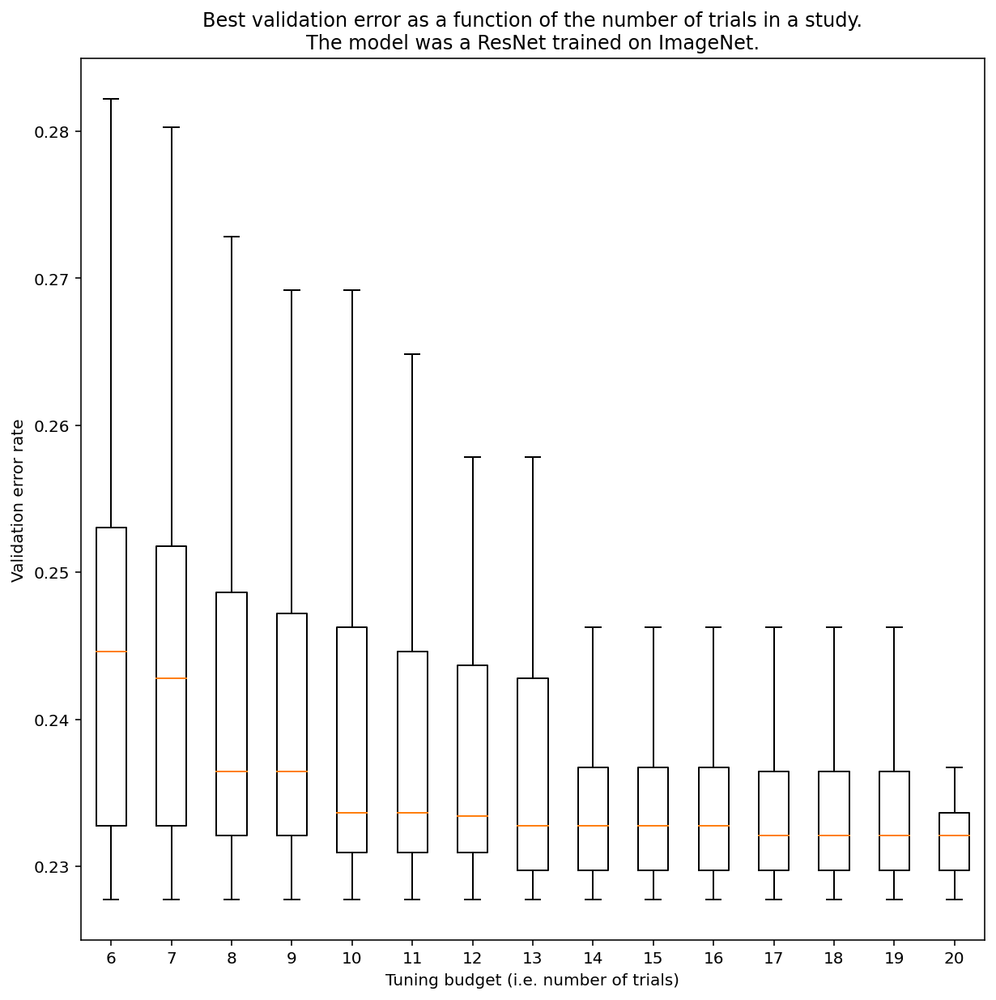
</p>

<p align="center"><b>図3:</b> ResNet-50はImageNet上で100回の試行を行い，チューニングを行った．ブートストラップにより，異なるチューニング予算がシミュレートされた．各試行予算における最適性能の箱ひげ図を上に示す．

-   この問いに一概に答えることはできないが，具体的な例を見ることはできる．
-   図3が示すように，試行回数は結果に大きな影響を与える可能性があります．
    -   試行回数が6回の場合と20回の場合では，四分位範囲がいかに大きいかに注目してください．
    -   20回の試行でも，特に幸運な研究と不運な研究の差は，ハイパーパラメータを固定し，異なるランダムシードでこのモデルを再トレーニングした場合の一般的な変動よりも大きくなる可能性があります．（この作業負荷では，バリデーションエラー率約23%で約±0.1%）

</details>

<a id="how-can-optimization-failures-be-debugged-and-mitigated"></a>
### 最適化の失敗をどのようにデバッグし，軽減することができるか？

<details><summary><em>[Click to expand]</em></summary>

<br>

***要約:*** *もしモデルに最適化の問題があれば，他のことを試す前にそれを解決することが重要です．トレーニングの失敗を診断し修正することは，活発な研究分野です．*

<p align="center">
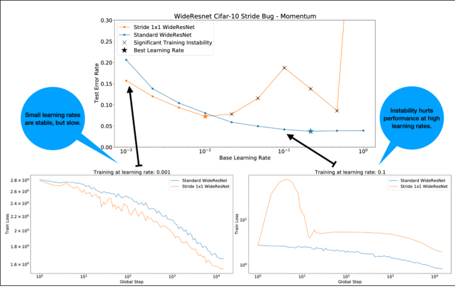
</p>


<p align="center"><b>図4:</b> WideResnetの1つの残差ブロック（2x2 -> 1x1）の歩幅を変更すると，学習が不安定になる．これは，低い学習率では性能が低下しないが，高い学習率では不安定になり，うまく学習できない．1000ステップの学習率ウォームアップを行うことで，この不安定性を解消し，最大学習率0.1での安定した学習を可能にした．</p>

#### 不安定なワークロードの特定
-   学習率が大きすぎると，どんなワークロードも不安定になる．不安定さが問題になるのは，小さすぎる学習率を使わざるを得なくなったときだけである．
-   学習の不安定さには，少なくとも2つのタイプがあり，区別する価値がある．
    1.  初期化時やトレーニングの初期に発生する不安定性
    2.  トレーニングの途中で突然不安定になること．
-   作業負荷の安定性の問題を特定するために，系統的なアプローチを取ることができます．
    1.  学習率スイープを行い，最適な学習率*を見つける．
    2.  学習率*以上の学習率で学習ロスカーブをプロットする．
    3.  もし，学習率 > 学習率* が損失の不安定性を示すなら（学習期間中に損失が増加し，減少しない），その不安定性を修正することが，より良い学習をもたらすと思われる．
-   学習中の全損失勾配のL2ノルムを記録すると，異常値によって学習中に不安定性が発生する可能性があります．これはgradientやupdate clippingをどのように選択するかという情報になります．
**注意：**モデルによっては，初期に不安定な状態になり，その後，回復して，ゆっくりではあるが安定した学習ができるものもあります．**一般的な評価スケジュールは，十分な頻度で評価しないため，このような問題を見逃す可能性があります!**
これを確認するために，`lr = 2 * current best`を使用して，\~500ステップの短縮されたトレーニングを行うことができますが，すべてのステップを評価します．

<p align="center">
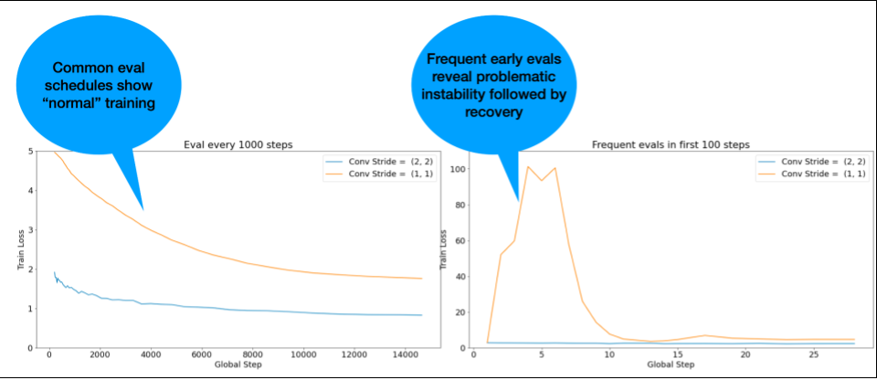
</p>

<p align="center"><b>図5:</b> トレーニング開始時の評価をより頻繁に行うことの価値を示す図．学習初期にモデルが不安定になる可能性がある場合に有効．</p>

#### よくある不安定なパターンに対する修正の可能性
-   学習速度のウォームアップを適用
    -   初期の学習が不安定な場合に最適です．
-   勾配クリッピングの適用
    -   初期・中期学習不安定に有効，warmupでは直せない悪いインプットも直せる可能性がある．
-   新しいオプティマイザを試す
    -   AdamはMomentumが扱えない不安定性を扱えることがある．これは活発な研究分野です．
-   モデルアーキテクチャのベストプラクティス/初期化を確実に行うことができる（以下の例）．
    -   モデルにまだ含まれていない場合は，残留接続(residual connections)と正規化を追加します．
-   正規化は，残差の前の最後の操作であるべきです．例：x + Norm(f(x))．
-   Norm(x + f(x))は問題を引き起こすことが知られています．
-   残差分岐を0に初期化してみてください(例：[ReZero init](https://arxiv.org/abs/2003.04887))．
-   学習率を下げる
    -   これは最後の手段です．

#### 学習速度ウォームアップ

<p align="center">
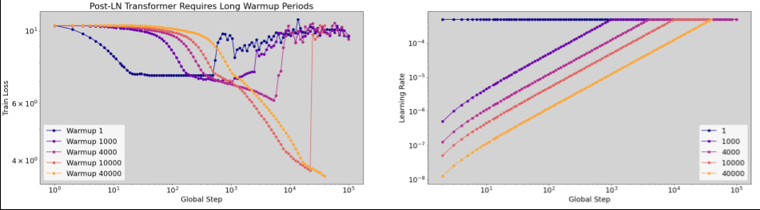
</p>

<p align="center"><b>図6:</b> ウォームアップ時の不安定さの一例（横軸の対数スケールに注意）．この場合，トレーニングを成功させるためには40k歩のウォームアップが必要であった．</p>

#### 学習率ウォームアップを適用するタイミング

<p align="center">
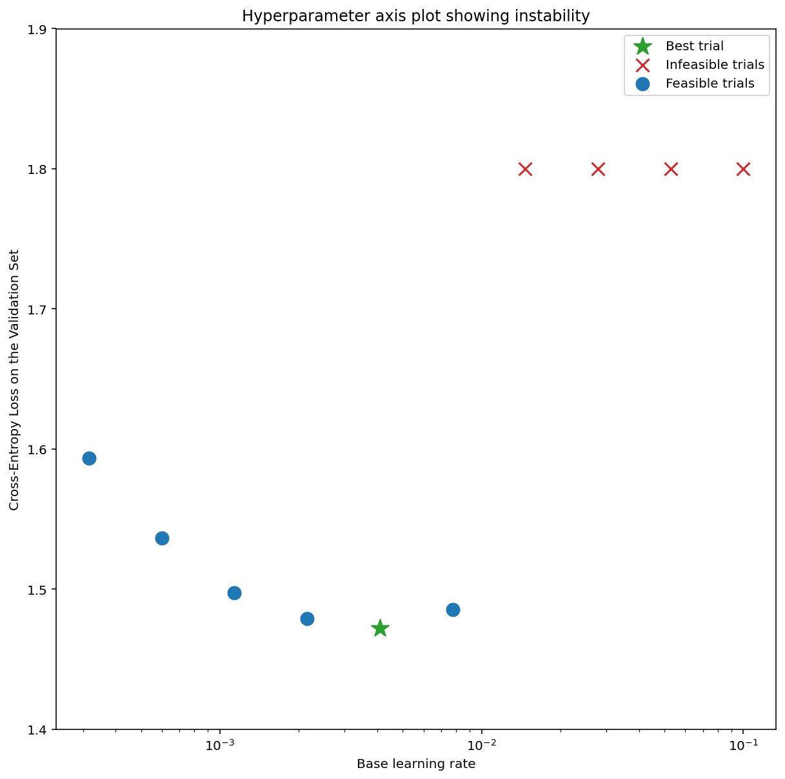
</p>

<p align="center"><b>図7a:</b> 学習が不安定なモデルのハイパーパラメータ軸プロットの一例．最適な学習率は，実行可能な範囲の端にある．「実現不可能」な試行とは，NaN を発生させるか，損失が異常に大きい試行と定義される．</p>

<p align="center">
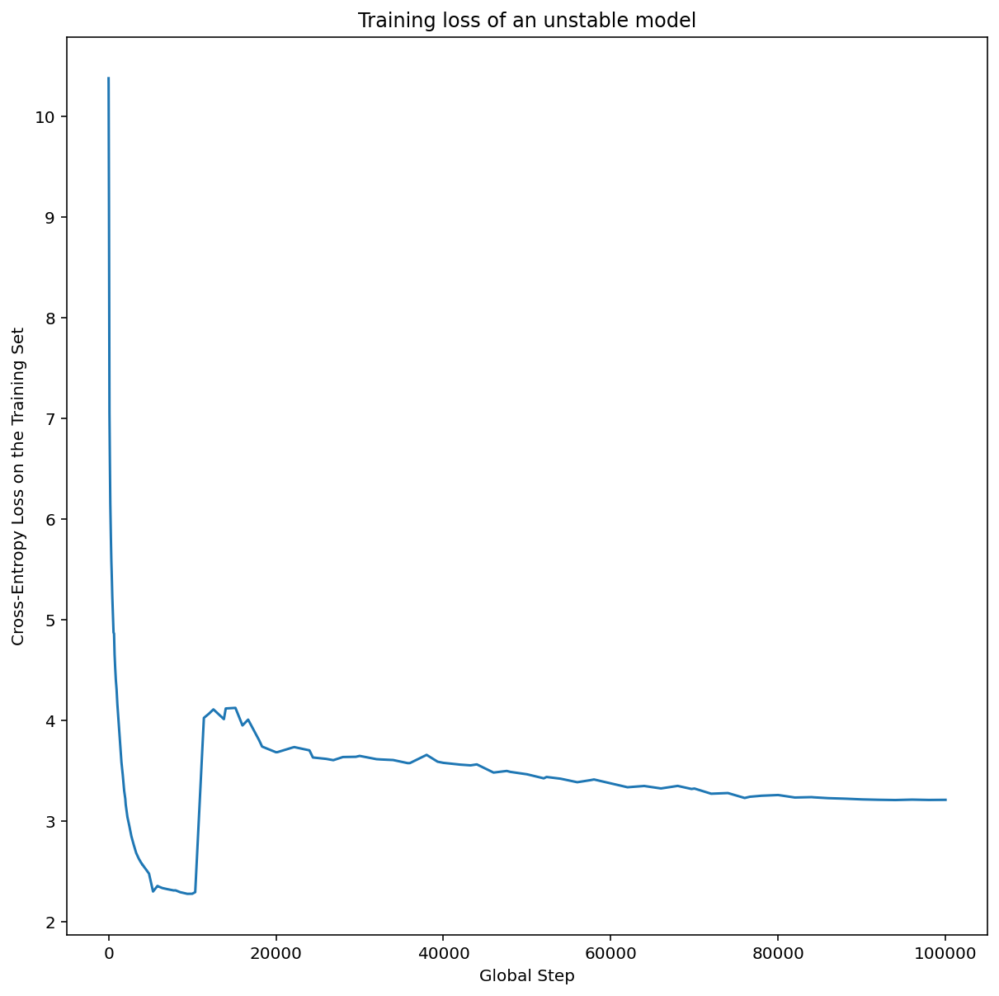
</p>

<p align="center"><b>図7b:</b> 不安定さが見られる学習率で学習させたモデルの学習損失．</p>

-   図7aは，最適化が不安定なモデルを示すハイパーパラメータ軸プロットで，最適な学習率が不安定になるぎりぎりのところにあることを示しています．
-   図7bは，このピークよりも5倍または10倍大きな学習率で学習させたモデルの学習損失を調べることで，これをダブルチェックする方法を示しています．もしこのプロットが，一定の減少の後に損失が急激に増加している場合（例えば上の図の\~10kのステップ），そのモデルは最適化の不安定性に悩まされている可能性があります．


<a id="How-to-apply-learning-rate-warmup"></a>
#### 学習率ウォームアップの適用方法

<p align="center">
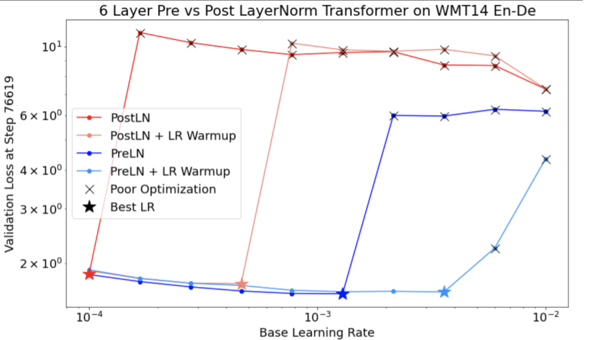
</p>

<p align="center"><b>図8:</b> 学習速度のウォームアップがトレーニングの不安定性に対処する上で有益な効果．</p>

-   上記のセクションを利用して，モデルが不安定になる学習率を既に特定したと仮定します．これが`unstable_base_learning_rate`である．
-   ウォームアップには，学習率を0から，`unstable_base_learning_rate`より少なくとも1桁大きい安定した`base_learning_rate`に上昇させる学習率スケジュールを前置することが含まれます．デフォルトでは，不安定な基本学習速度の10倍の基本学習速度が試される．しかし，100倍の`unstable_base_learning_rate`でこの手順全体を再度実行することが可能であることに注意してください．
    -   具体的なスケジュールは`warmup_steps`で0から`base_learning_rate`まで上昇させる．
    -   `post_warmup_steps`は一定の速度で学習する．
-   我々の目標は，`unstable_base_learning_rate`よりもはるかに高いピーク学習レートにアクセスできる，最短の`warmup_steps`の数を見つけることです．
-   そのため，それぞれの`base_learning_rate`に対して，`warmup_steps`と`post_warmup_steps`を調整する必要があります．通常，`post_warmup_steps` は `2*warmup_steps`に設定すれば問題ないでしょう．
-   Warmupは既存の減衰スケジュールと独立して調整することができる．`warmup_steps`は，いくつかの異なるオーダーで掃引する必要がある．例えば，研究例では，[10, 10<sup>3</sup>, 10<sup>4</sup>,10<sup>5</sup>]を試すことができる．最大の実行可能ポイントは，`max_train_steps`の10%以上であってはならない．
-   `base_learning_rate`での学習を吹き飛ばさない`warmup_steps`が確立されたら，それをベースラインモデルに適用する必要があります．基本的に，このスケジュールを既存のスケジュールの上に追加し，この実験とベースラインを比較するために，上述の最適なチェックポイントの選択を使用します．例えば，元々10,000 max_train_stepsで，warmup_stepsを1000ステップ行った場合，新しい学習手順は合計11,000ステップで実行されるはずです．
-   安定したトレーニングのために長い`warmup_steps`が必要な場合（`max_train_steps`の5%以上），これを考慮して`max_train_steps`を増加させる必要があるかもしれません．
-   ワークロードの全範囲にわたって「典型的な」値があるわけではありません．100ステップで済むモデルもあれば，40k以上のステップが必要なモデル（特に変換器）もあります．

#### 勾配のクリッピング(Gradient clipping)
<p align="center">
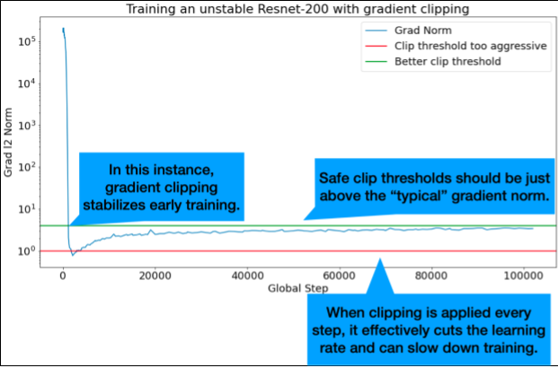
</p>

<p align="center"><b>図9:</b> 学習初期の不安定さを修正する勾配クリッピングの説明図．</p>

-   勾配クリッピングは，大きな勾配や異常な勾配の問題が発生した場合に最も有効です．
-   クリッピングはトレーニング初期の不安定さ（初期の大きな勾配ノルム），またはトレーニング中期の不安定さ（トレーニング中の突然の勾配スパイク）のいずれかを修正することができます．
-   ウォームアップ期間を長くすることで，クリッピングでは修正できない不安定さを修正できる場合があります．([上記のこのセクション](#How-to-apply-learning-rate-warmup)を参照してください．)
    -   🤖ウォームアップ中のクリッピングはどうするのですか？
-   理想的なクリップのしきい値は「典型的な」勾配ノルムのすぐ上にあります．
-   以下は，勾配クリッピングの例です．
    -   もし勾配ノルム $\left | g \right |$が勾配クリッピングのしきい値 $\lambda$より大きければ，${g}'$を新たな勾配として${g}'= \lambda \times \frac{g}{\left | g \right |}$のようにします．
-   学習中のクリップされていない勾配ノルムを記録します．デフォルトでは，生成します．
    -   勾配ノルム vs ステップのプロット
    -   全ステップにわたって集計された勾配ノルムのヒストグラム
-   勾配ノルムの90パーセンタイルに基づいて，勾配クリッピングの閾値を選択します．
    -   閾値は作業負荷に依存しますが，90%は良い出発点です．うまくいかない場合は，この閾値を調整することができる．
    -   🤖 ある種の適応的な戦略はどうでしょうか？
-   勾配クリッピングを試してみて，不安定性の問題が残るようなら，より強く試すことができます（つまり，閾値を小さくする）．
-   極端に攻撃的な勾配クリッピングは，要するに学習率を下げるための奇妙な方法です．もし極端にアグレッシブなクリッピングを使用していることに気づいたら，おそらく代わりに学習率を下げるべきでしょう．
-   通常，更新の50％以上が何らかの形でクリッピングされることを「極めて積極的」と見なします．
-   不安定性の問題に対処するために極めて積極的な勾配クリッピングを行う必要があるのなら，学習率を下げたほうがよいでしょう．

</details>

### 学習率やその他の最適化パラメータをハイパーパラメータと呼ぶのはなぜですか？どのような事前分布のパラメータでもありません．

<details><summary><em>[Click to expand]</em></summary>
<br>

-   確かに「ハイパーパラメータ」という言葉はベイズ機械学習において正確な[意味](https://en.wikipedia.org/wiki/Hyperparameter)を持ち，学習率や深層学習で調整する他のパラメータのほとんどを「ハイパーパラメータ」と呼ぶのは用語の乱用である．
-   我々は，学習率，アーキテクチャパラメータ，および深層学習で調整する他のすべてのものに対して「メタパラメータ」という用語を使用することを好む．なぜなら，「ハイパーパラメータ」という用語を誤って使用することから生じる混乱の可能性を回避することができる（確率的応答曲面モデルがそれ自身の真のハイパーパラメータを持っているベイズ最適化を議論する際に，特に起こり得る混乱）．
-   残念ながら，混乱を招く可能性はあるものの，ハイパーパラメーターという言葉は深層学習界では極めて一般的になっている．
-   そのため，この文書のように，この技術的なことを知らないであろう多くの人々を含む幅広い読者を対象とした文書では，別の混乱を避けるために，この分野の混乱の原因の1つに貢献することを選択しました．
-   とはいえ，研究論文を発表するときには別の選択をするかもしれませんし，ほとんどの文脈で代わりに「メタパラメータ」を使うよう他の人に勧めたいと思います．

</details>


<a id="why-shouldnt-the-batch-size-be-tuned-to-directly-improve-validation-set-performance"></a>
### 検証セットの性能を直接向上させるために，バッチサイズを調整してはいけないのでしょうか？

<details><summary><em>[Click to expand]</em></summary>
<br>

-   *トレーニングパイプラインの他の詳細を変更せずに*バッチサイズを変更すると，多くの場合，バリデーションセットの性能に影響を及ぼします．
-   しかし，トレーニングパイプラインをバッチサイズごとに独立して最適化すると，2つのバッチサイズ間のバリデーションセットの性能の差は，通常なくなります．
-   バッチサイズと最も強く相互作用するハイパーパラメータは，オプティマイザのハイパーパラメータ（例：学習率，運動量）と正則化のハイパーパラメータです．
    -   バッチサイズが小さいと，サンプルの分散により学習アルゴリズムに多くのノイズが混入し，このノイズが正則化の効果をもたらす可能性があります．したがって，バッチサイズが大きくなると過学習が起こりやすくなり，より強力な正則化および/または追加の正則化技術が必要になる場合があります．
-   また，バッチサイズを変更する際には，[学習ステップの数を調整](#choosing-the-batch-size-to-minimize-training-time)する必要がある場合もあります．
-   これらの効果をすべて考慮すると，バッチサイズが最大達成可能な検証性能に影響を与えるという説得力のある証拠は今のところありません（[Shallue et al.2018](https://arxiv.org/abs/1811.03600)参照）．

</details>

<a id="what-are-the-update-rules-for-all-the-popular-optimization-algorithms"></a>
### 一般的な最適化アルゴリズムの更新ルールとは？


<details><summary><em>[Click to expand]</em></summary>
<br>


#### Stochastic gradient descent (SGD)

$ $\theta_{t+1} = \theta_{t} - \eta_t \nabla \mathcal{l}(\theta_t)$$

#### Momentum

$$v_0 = 0$$

$$v_{t+1} = \gamma v_{t} + \nabla \mathcal{l}(\theta_t)$$

$ $\theta_{t+1} = \theta_{t} - \eta_t v_{t+1}$$

#### Nesterov

$$v_0 = 0$$

$$v_{t+1} = \gamma v_{t} + \nabla \mathcal{l}(\theta_t)$$

$ $\theta_{t+1} = \theta_{t} - \eta_t( \gamma v_{t+1} + \nabla \mathcal{l}(\theta_{t})$$

#### RMSProp

$$v_0 = 1 \text{,} m_0 = 0$$

$$v_{t+1} = \rho v_{t} + (1 - \rho) \nabla \mathcal{l}(\theta_t)^2$$

$$m_{t+1} = \gamma m_{t} + \frac{\eta_t}{\sqrt{v_{t+1} + \epsilon}}\nabla \mathcal{l}(\theta_t)$$

$ $\theta_{t+1} = \theta_{t} - m_{t+1}$$

#### ADAM

$$m_0 = 0 \text{,} v_0 = 0$$

$$m_{t+1} = \beta_1 m_{t} + (1 - \beta_1) \nabla \mathcal{l} (\theta_t)$$

$$v_{t+1} = \beta_2 v_{t} + (1 - \beta_2) \nabla \mathcal{l}(\theta_t)^2$$

$$b_{t+1} = \frac{\sqrt{1 - \beta_2^{t+1}}}{1 - \beta_1^{t+1}}$$

$ $\theta_{t+1} = \theta_{t} - \alpha_t \frac{m_{t+1}}{\sqrt{v_{t+1}} + \epsilon} b_{t+1}$$

#### NADAM

$$m_0 = 0 \text{,} v_0 = 0$$

$$m_{t+1} = \beta_1 m_{t} + (1 - \beta_1) \nabla \mathcal{l} (\theta_t)$$

$$v_{t+1} = \beta_2 v_{t} + (1 - \beta_2) \nabla \mathcal{l} (\theta_t)^2$$

$$b_{t+1} = \frac{\sqrt{1 - \beta_2^{t+1}}}{1 - \beta_1^{t+1}}$$

$ $\theta_{t+1} = \theta_{t} - \alpha_t \frac{\beta_1 m_{t+1} + (1 - \beta_1) \nabla \mathcal{l} (\theta_t)}{\sqrt{v_{t+1}} + \epsilon} b_{t+1}$$

</details>


<a id="acknowledgments"></a>
## 謝辞
-   Max Bileschi, Roy Frostig, Zelda Mariet, Stan Bileschi, Mohammad Norouzi, Chris DuBois, Charles Suttonには，原稿を読んでいただき，貴重なご意見をいただいたことに感謝します．
-   また，Naman Agarwalが他の共同研究で元々作成していたいくつかのプロットの実験データを再利用した．
-   原稿のプレゼンテーションについて貴重な助言をいただいたWill Chenに感謝する．
-   また，Rohan Anil氏には有益な議論をいただいた．

<a id="citing"></a>
## 引用
```
@misc{tuningplaybookgithub,
  author = {Varun Godbole and George E. Dahl and Justin Gilmer and Christopher J. Shallue and Zachary Nado},
  title = {Deep Learning Tuning Playbook},
  url = {http://github.com/google/tuning_playbook},
  year = {2023},
  note = {Version 1.0}
}
```

<a id="contributing"></a>
## 寄稿

-   本製品はGoogleの公式サポート製品ではありません．
-   ぜひ，ご意見をお聞かせください
    -   このプレイブックが気に入ったら，ぜひ[星を付けてください](https://docs.github.com/en/get-started/exploring-projects-on-github/saving-repositories-with-stars#starring-a-repository)．または deep-learning-tuning-playbook \[at\] googlegroups.com までメールしてください．お客様の声は，このようなリソースをより多く作成することを正当化する助けになります．
    -   もし何か間違っていると思われることがあれば，issueを提出して議論を始めてください．質問やその他のメッセージで issue が適切でない場合は，GitHub で新しいディスカッショントピックを立ててください．
-   前文で述べたように，これは生きている文書です．大なり小なり，定期的に改良を加えていく予定です．もし通知を受けたい場合は，私たちのリポジトリをウォッチしてください ([説明](https://docs.github.com/en/account-and-profile/managing-subscriptions-and-notifications-on-github/setting-up-notifications/configuring-notifications#configuring-your-watch-settings-for-an-individual-repository)を参照)．
最初に課題追跡システムを通じて作者と調整することなく，プルリクエストを提出するのはやめてください．

### コントリビューター使用許諾契約書
このプロジェクトへの貢献は，貢献者ライセンス契約（CLA）を伴わなければなりません．あなた（またはあなたの雇用主）は，あなたの貢献に対する著作権を保持します．これは単に，あなたの貢献をプロジェクトの一部として使用し，再配布する許可を与えるものです．https://cla.developers.google.com/ にアクセスして，現在登録されている契約書を確認したり，新しい契約書に署名したりできます．

通常，CLAを提出するのは一度だけなので，すでにCLAを提出している場合は（それが別のプロジェクト用であっても），おそらく再度提出する必要はありません．

### コードレビュー
プロジェクトメンバーによる投稿を含め，すべての投稿はレビューが必要です．この目的のために，GitHubのプルリクエストを使用しています．プルリクエストの使い方については，[GitHubのヘルプ](https://help.github.com/articles/about-pull-requests/)を参照してください．

### コミュニティガイドライン
このプロジェクトは，[Google's Open Source Community Guidelines](https://opensource.google/conduct/)に準拠しています．
